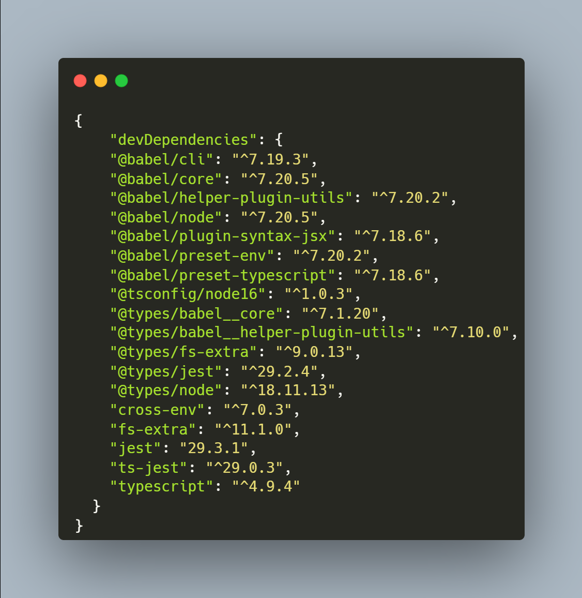
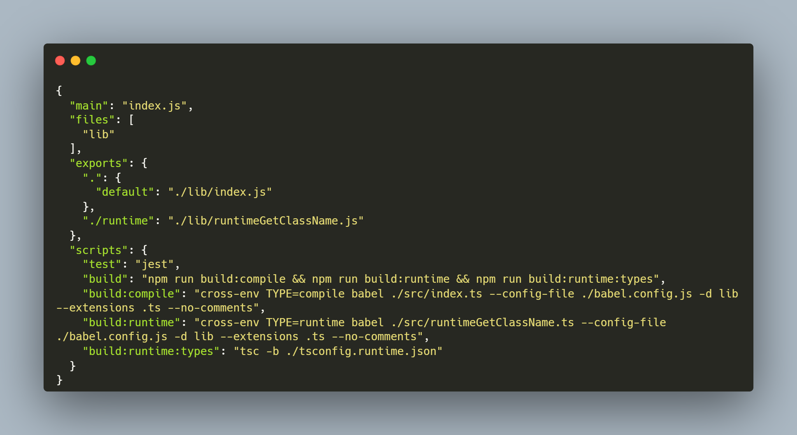
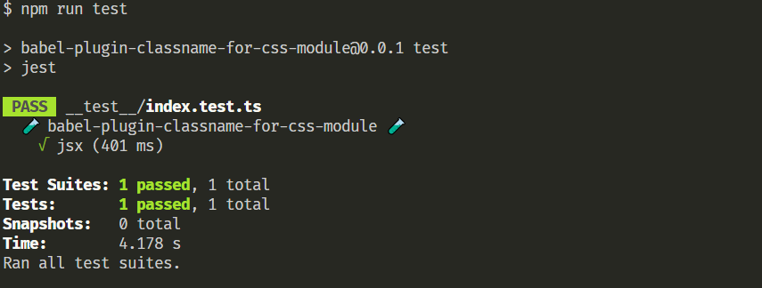
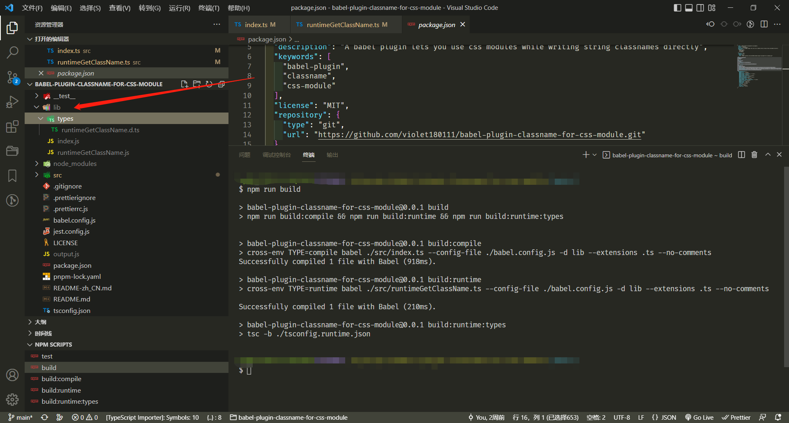
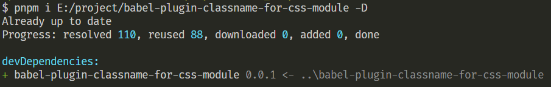
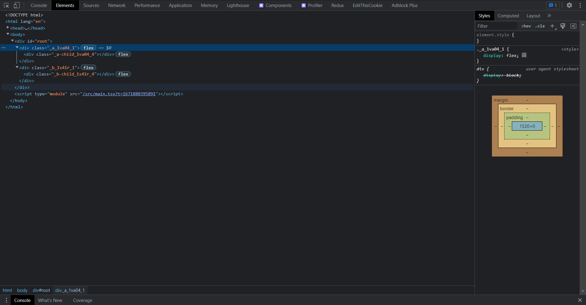

本文章记录了一次写 **babel** 插件的过程，👉 [GitHub 仓库链接](https://github.com/violet180111/babel-plugin-classname-for-css-module)

### ✨ 特性

这个插件允许你在 jsx 中 **直接** 编写字符串类名，然后这些类名将 **自动适应** css module

#### 如下:

```jsx
import './style1.module.css';
import './style2.module.css';
import './style3.module.css' /* test1 */;
import './style4.module.css' /* test2 */;

function Test() {
  return;
  <>
    <div className="test"></div>
    <div className="test1 test2"></div>
    <div className="test1.a test2.b"></div>
    <div className={`${Math.random() > 0.5 ? 'a' : 'b'}`}></div>
    <div className={(function (a, b) {})('a', 'b')}></div>
    <div className={((a, b) => {})('a', 'b')}></div>
    <div className={fn('a', 'b')}></div>
    <div className={[].map(() => {})}></div>
    <div className={Math.random() > 0.5 ? 'a' : 'b'}></div>
    <div className={['a', 'b']}></div>
    <div className={(a = 'a')}></div>
    <div className={'a' + 'b'}></div>
    <div className={'a'}></div>
    <div className={function () {}}></div>
    <div className={() => {}}></div>
    <div className={class {}}></div>
    <div className={a}></div>
    <div className={this}></div>
  </>;
}
```

#### 将会被转换为:

```jsx
import _gcn from 'babel-plugin-classname-for-css-module/runtime';
import _style from './style1.module.css';
import _style2 from './style2.module.css';
import _test from './style3.module.css';
import _test2 from './style4.module.css';
const _sym = {
  style1: '_style',
  _style,
  style2: '_style2',
  _style2,
  test1: '_test',
  _test,
  test2: '_test2',
  _test2,
};
function Test() {
  return;
  <>
    <div className={_gcn('test', _sym)}></div>
    <div className={_gcn('test1 test2', _sym)}></div>
    <div className={_gcn('test1.a test2.b', _sym)}></div>
    <div className={_gcn(`${Math.random() > 0.5 ? 'a' : 'b'}`, _sym)}></div>
    <div className={_gcn((function (a, b) {})('a', 'b'), _sym)}></div>
    <div className={_gcn(((a, b) => {})('a', 'b'), _sym)}></div>
    <div className={_gcn(fn('a', 'b'), _sym)}></div>
    <div
      className={_gcn(
        [].map(() => {}),
        _sym,
      )}
    ></div>
    <div className={_gcn(Math.random() > 0.5 ? 'a' : 'b', _sym)}></div>
    <div className={_gcn(['a', 'b'], _sym)}></div>
    <div className={_gcn((a = 'a'), _sym)}></div>
    <div className={_gcn('a' + 'b', _sym)}></div>
    <div className={_gcn('a', _sym)}></div>
    <div className={_gcn(function () {}, _sym)}></div>
    <div className={_gcn(() => {}, _sym)}></div>
    <div className={_gcn(class {}, _sym)}></div>
    <div className={_gcn(a, _sym)}></div>
    <div className={_gcn(this, _sym)}></div>
  </>;
}
```

`_gcn` 是一个运行时方法，所以你不需要显式地导入它。它将帮助你处理在运行时才能得到的类名，并且如果有多个样式文件被引入，它也能正确地帮助你处理类名之间的对应关系。

#### 如下:

```jsx
<div className="test1 test2"></div>
```

#### 将会被转换为:

```jsx
// 只是一个例子，实际转换后的类名由你写的css为准
<div className="_test1_ahvyq_8 _test2_ahvyq_46"></div>
```

### 📝 环境准备

插件使用 **typescript** 进行编写，使用 **jest** 作为测试工具，为了兼容低版本 **node** 环境中的 **import** 语法，还使用了 **babel** 进行语法转化，同时 **babel** 也能将 **ts** 文件进行转译为**js**文件，然后类型文件的生成则使用 **tsc**

**安装依赖**



**初始化文件**

```plain
├── __test__
	├── __fixtures__
		├── jsx
			├── code.js 测试源代码
			├── output.js 期望输出的代码结果
	├── index.test.ts 测试代码
├── src
	├── index.ts 主要的插件代码
	├── runtimeGetClassName.ts 运行时方法
├── .prettierignore
├── .prettierrc.js
├── babel.config.js
├── tsconfig.json // node 环境的 ts 配置
├── tsconfig.runtime.json // 运行时方法的 ts 配置
```

配置文件的代码这里就不展示了，可到仓库进行复制

最后在 **package.json** 文件中加入如下配置



### 🧩 编写插件代码

我们可以到这个[网站](https://astexplorer.net/)得到 **AST** 树

**index.ts**

首先引入 **@babel/helper-plugin-utils**，该插件提供了一些服务来确保插件运行良好，从而抛出有用的错误。

```ts
import { declare } from '@babel/helper-plugin-utils';
```

**babel** 插件通常暴露出一个函数，函数的入参有 **api** 、**options** 、**dirname**，分别代表 **babel** 提供的一些 **api**， 外面传入的配置项，目录，接着返回一个对象，对象里面通常包含 **name** (插件名字)和 **visitor** (插件的主要访问者)，**visitor**中的每个函数接收 2 个参数：`path` 和 `state`，**path** 是记录遍历路径的 **api**，它记录了父子节点的引用，还有很多增删改查 **AST** 的 **api**，**state** 是遍历过程中 **AST** 节点之间传递数据的方式

```ts
export default declare(function classNameForCssModulePlugin(api, options, dirname) {
  api.assertVersion(7); // 断言 babel 的版本

  return {
    visitor: {
      Program(path, state) {},
      Expression(path, state) {},
    },
  };
});
```

初始化一些必要变量

```ts
export default declare(function classNameForCssModulePlugin(api, options, dirname) {
  api.assertVersion(7); // 断言 babel 的版本

  const { types, template } = api;

  // 运行时的helper文件路径
  const runtimeUtilImportId = `${pkg.name}/runtime`;
  // 运行时导入的方法名
  const runtimeImportDefaultName = 'gcn';
  // 多个样式文件导入时，它们会被组合在一个 map 中，map 的名字
  const styleMap = 'sym';
  // 匹配./xxx.module.(css|less|sass|scss) => xxx.module
  const stylePathnameReg =
    /(?<=(?:\/))(?!^(PRN|AUX|CLOCK\$|NUL|CON|COM\d|LPT\d|\..*)(\..+)?$)[^\x00-\x1f\\?*:\";|/]+(?=((?=\.(?:css|less|sass|scss)$)))/;

  // 保存最后一个的ImportDeclaration 然后在其后面插入styleMap
  let lastImportNodePath: NodePath | null = null;

  return {
    visitor: {
      Program(path, state) {},
      Expression(path, state) {},
    },
  };
});
```

首先遍历一遍 **AST** 树，看是否引入了样式文件，是的话将 `import 'xxx.css'` 转化 为 `import style from 'xxx.css'`的形式，同时将其收集进 **styles** 中， 后面根据 **styles** 再存入 **styleMap**，如果 **styles.length === 1** 证明只引入了单个样式文件，**styleMap** 就是数组形式，**styles.length > 1** 是 **map** 形式，同时引入运行时方法，**styleMap** 也会被注入该 **module** 的作用域内（最后一个 **import** 语句的后面），否的话就什么也不做（**Program** 代表该文件整段程序根节点）

```ts
Program(path, state) {
  // 是否有样式文件导入的mark
  let isImportStyle = false;
  // 保存导入样式文件的对应的styleImportDefaultName和styleImportDefaultId
  let styles: Array<Array<string>> = [];

  path.traverse({
    ImportDeclaration(curPath) {
      lastImportNodePath = curPath;

      const pathname = curPath.node.source.value;
      const regExpMatchArray = pathname.match(stylePathnameReg);

      if (regExpMatchArray) {
        const [styleImportName, moduleSymbol] = regExpMatchArray[0].split('.');

        if (moduleSymbol === 'module') {
          // 有注释就取注释当作 styleImportDefaultName 没有就取 xxx.module.(css|less|sass|scss) => xxx
          // 同时把注释去除
          const leadingCommentStyleImportName = curPath.node.source.trailingComments?.shift();
          const styleImportDefaultName = leadingCommentStyleImportName
            ? leadingCommentStyleImportName.value.replace(/[\s\*]/g, '')
            : styleImportName;
          const styleImportDefaultId = path.scope.generateUid(styleImportDefaultName);

          styles.push([styleImportDefaultName, styleImportDefaultId]);
          isImportStyle = true;

          curPath.replaceWith(
            template.statement(`import ${styleImportDefaultId} from '${pathname}';`)()
          );
		  // 跳过剩余子节点的处理
          curPath.skip();
        }
      }
    },
  });

  if (isImportStyle) {
    const runtimeUtilImportDefaultName = path.scope.generateUid(runtimeImportDefaultName);

    state.set('runtimeUtilImportDefaultName', runtimeUtilImportDefaultName);

    // 注入运行时helper
    path.unshiftContainer(
      'body',
      template.statement(`import ${runtimeUtilImportDefaultName} from '${runtimeUtilImportId}'`)()
    );

    const styleMapId = path.scope.generateUid(styleMap);

    state.set('styleMapId', styleMapId);

    let styleExpressionCode = '';

    // 如果引入的样式文件超过一个则styleMap为对象形式，否则是数组形式
    if (styles.length > 1) {
      styleExpressionCode = `{${styles.reduce((acc, cur) => {
        const [styleImportDefaultName, styleImportDefaultId] = cur;

        return `${acc}${styleImportDefaultName}: '${styleImportDefaultId}', ${styleImportDefaultId},`;
      }, '')}}`;
    } else {
      const [_, styleImportDefaultId] = styles[0];

      styleExpressionCode = `[${styleImportDefaultId}]`;
    }

    // 在最后一个import后面插入styleMap
    (<NodePath>lastImportNodePath).insertAfter(
      types.variableDeclaration('const', [
        types.variableDeclarator(
          types.identifier(styleMapId),
          template.expression(styleExpressionCode)()
        ),
      ])
    );
  }
}
```

然后到转化 **className** ，分别有 **className="xxx"** 和 **className=\{xxx\}**，这两种都可以算是表达式（执行完以后有返回值），要做的转化是统一将等号右边的表达式传入运行时方法，注意"xxx"这种情况需要在外侧加上 **JSXExpressionContainer**

```ts
Expression(path, state) {
  const parentPath = path.findParent(p => p.isJSXAttribute());

  if (!parentPath) return;

  if (parentPath.isJSXAttribute() && parentPath.node.name.name === 'className') {
    const styleStatement = `${state.get(
      'runtimeUtilImportDefaultName'
    )}(${path.getSource()}, ${state.get('styleMapId')})`;
    const styleExpression = template.expression(styleStatement)();

    if (path.parentPath.isJSXExpressionContainer()) {
      path.replaceWith(styleExpression);
    } else {
      // 处理<div className="test"></div>的情况 className不是被jsxExpressionContainer包裹的字符串
      path.replaceWith(types.jsxExpressionContainer(styleExpression));
    }

    // 跳过剩余子节点的处理
    path.skip();
  }
}
```

**runtimeGetClassName.ts**

运行时方法的工作，就是区分引入的是单个还是多个样式文件，然后再将 **map** 里面对应的加了 **hash** 后缀 **className** 取出再拼接起来返回

```ts
type S = string;
type SR = Record<S, S>;

export default function getClassName(
  classNameWithStyleKey: S,
  styleObj: Record<S, SR | S> | Array<SR>,
) {
  // 将多余空格去除
  classNameWithStyleKey.replace(/\s{2,}/, ' ');

  // 分割 className
  const classNameList = classNameWithStyleKey.split(' ');
  // 判断引入是单个样式文件还是多个样式文件
  const isArray = Array.isArray(styleObj);

  return classNameList
    .reduce((acc, cur) => {
      // 将 xx.xxx 分割出来 [xx, xxx]
      const [key, name] = cur.split('.');
      // 多个样式文件会被处理成，防止样式 map 的名字冲突
      // {
      //	xxx1: '_xxx1',
      //  	xxx2: '_xxx2',
      //	_xxx1: {},
      //	_xxx2: {}
      // }
      const className = isArray
        ? styleObj[0][name ?? key]
        : (<SR>styleObj[<string>(<Record<S, SR | S>>styleObj)[key]])[name];

      return `${acc} ${className ?? cur}`;
    }, '')
    .trimStart();
}
```

### 🧪 编写测试代码

**index.test.ts**

测试代码逻辑很简单，就是读取测试源代码文件和期望的代码文件，调用 **babel** 的 **API** 进行转化，将转化后的代码与我们期望的代码进行对比，注意代码可能有很多空格，换行符什么的，我们需要将它们统一替换成一个空格，不然会影响对比

```ts
import path from 'path';
import fse from 'fs-extra';
import { transformSync } from '@babel/core';
import classnameForCssModule from '../src/index';
import type { BabelFileResult } from '@babel/core';

function newlineTrimmingSerializer(val: string) {
  const trimReg = /[\s\r\n]+/g;

  return val.replace(trimReg, ' ');
}

function readeFileWithTrim(dir: string): { sourceCode: string; expectOutput: string } {
  const codePath = path.resolve(dir, 'code.js');
  const outputPath = path.resolve(dir, 'output.js');
  const sourceCode = fse.readFileSync(codePath, {
    encoding: 'utf-8',
  });
  const expectOutput = fse.readFileSync(outputPath, {
    encoding: 'utf-8',
  });

  return {
    sourceCode,
    expectOutput,
  };
}

const testDirRoot = path.resolve(__dirname, '__fixtures__');

function getOutput(testPathname: string): {
  actualOutput: string;
  actualTrimOutput: string;
  expectOutput: string;
} {
  const { sourceCode, expectOutput } = readeFileWithTrim(path.resolve(testDirRoot, testPathname));

  const { code: actualOutput } = <BabelFileResult>transformSync(sourceCode, {
    sourceType: 'unambiguous',
    configFile: false,
    babelrc: false,
    plugins: [classnameForCssModule, '@babel/plugin-syntax-jsx'],
    // compact: true,
  });

  return {
    actualOutput: <string>actualOutput,
    actualTrimOutput: newlineTrimmingSerializer(<string>actualOutput),
    expectOutput: newlineTrimmingSerializer(expectOutput),
  };
}

describe('🧪 babel-plugin-classname-for-css-module 🧪', () => {
  const testDirs = fse.readdirSync(testDirRoot);

  test('jsx', () => {
    const { actualOutput, actualTrimOutput, expectOutput } = getOutput(testDirs[0]);

    fse.writeFileSync(path.resolve(__dirname, '../output.js'), actualOutput);

    expect(actualTrimOutput).toBe(expectOutput);
  });
});
```

最后运行 `npm run test`



大功告成 🥳🥳🥳

### 👨‍💻 引入真实场景

在引入之前，执行一下打包命令 `npm run build`



然后搭一个 **react** 环境，这里用的是 **vite**

**vite.config.ts**

```ts
import { defineConfig } from 'vite';
import react from '@vitejs/plugin-react';

// https://vitejs.dev/config/
export default defineConfig({
  plugins: [
    react({
      babel: {
        plugins: ['babel-plugin-classname-for-css-module'],
      },
    }),
  ],
  server: {
    open: true,
  },
});
```

可以发布到 **npm** 上再安装下来，这里选用的直接本地安装的形式

**npm i 该包的文件路径**，注意 **window** 和 **linux** 的下的路径形式是不一样的



测试代码如下

```jsx
import ReactDOM from 'react-dom/client';
import './style3.module.less' /* test1 */;
import './style4.module.sass' /* test2 */;

// style3.module.less
// .a {
//   display: flex;

//   &-child {
//     display: flex;
//   }
// }

// style4.module.sass
// .b
//   display: flex
//   &-child
//     display: flex

ReactDOM.createRoot(document.getElementById('root') as HTMLElement).render(
  <>
    <div className="test1.a">
      <div className="test1.a-child"></div>
    </div>
    <div className="test2.b">
      <div className="test2.b-child"></div>
    </div>
  </>,
);
```

结果如下



大功告成 🥳🥳🥳

参考文章

- [babel 插件手册](https://github.com/jamiebuilds/babel-handbook/blob/master/translations/zh-Hans/plugin-handbook.md)

- [Babel 插件通关秘籍](https://juejin.cn/book/6946117847848321055)
