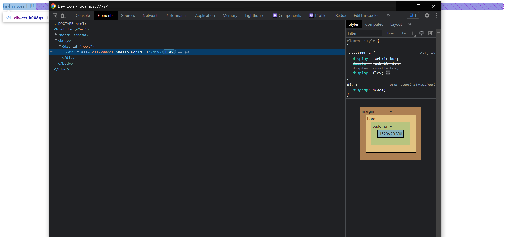
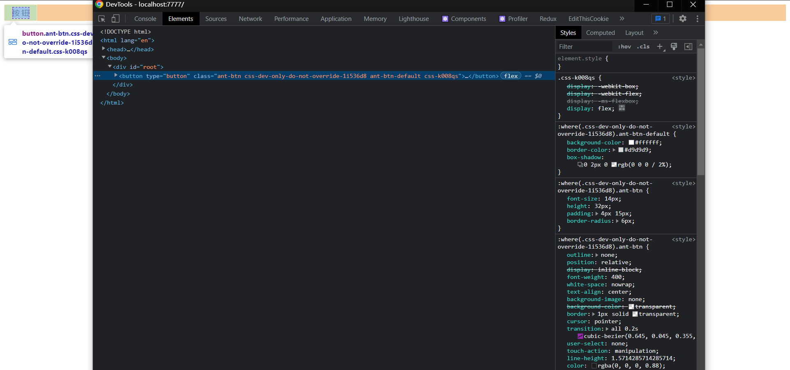
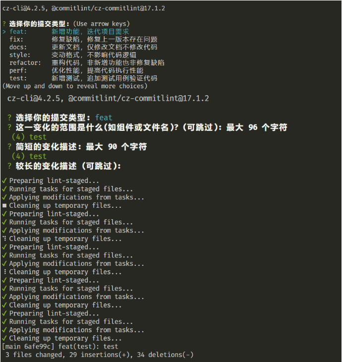

该小节介绍怎么配置 `react` 的开发环境运行
[点此处进入 github 仓库(注：该 react 环境仅是作者抱着学习的态度搭建，生产环境下谨慎使用)](https://github.com/violet180111/react_scaffold)

### 1. 创建 package.json 文件

```
终端执行 npm init -y

├──package.json
```

**下面是搭建该环境用到的依赖，后面会一步步安装**

```json
{
  "devDependencies": {
    "@babel/core": "^7.19.0",
    "@babel/plugin-transform-runtime": "^7.18.10",
    "@babel/preset-env": "^7.19.0",
    "@babel/preset-react": "^7.18.6",
    "@babel/preset-typescript": "^7.18.6",
    "@commitlint/cz-commitlint": "^17.1.2",
    "@emotion/react": "^11.10.4",
    "@pmmmwh/react-refresh-webpack-plugin": "^0.5.7",
    "@types/react": "^18.0.18",
    "@types/react-dom": "^18.0.6",
    "@types/webpack-env": "^1.18.0",
    "@typescript-eslint/eslint-plugin": "^5.36.2",
    "@typescript-eslint/parser": "^5.36.2",
    "babel-loader": "^8.2.5",
    "browserslist": "^4.21.4",
    "chalk": "^4.1.2",
    "commitizen": "^4.2.5",
    "commitlint": "^17.1.2",
    "compression-webpack-plugin": "^10.0.0",
    "conventional-changelog-conventionalcommits": "^5.0.0",
    "copy-webpack-plugin": "^11.0.0",
    "core-js": "^3.25.1",
    "cross-env": "^7.0.3",
    "css-loader": "^6.7.1",
    "css-minimizer-webpack-plugin": "^4.0.0",
    "eslint": "^8.23.0",
    "eslint-config-prettier": "^8.5.0",
    "eslint-config-standard-with-typescript": "^22.0.0",
    "eslint-plugin-import": "^2.26.0",
    "eslint-plugin-n": "^15.2.5",
    "eslint-plugin-prettier": "^4.2.1",
    "eslint-plugin-promise": "^6.0.1",
    "eslint-plugin-react": "^7.31.7",
    "eslint-plugin-react-hooks": "^4.6.0",
    "fork-ts-checker-webpack-plugin": "^6.5.0",
    "html-webpack-plugin": "^5.5.0",
    "husky": "^8.0.1",
    "inquirer": "8",
    "lint-staged": "^13.0.3",
    "mini-css-extract-plugin": "^2.6.1",
    "prettier": "^2.7.1",
    "react-refresh": "^0.14.0",
    "speed-measure-webpack-plugin": "^1.5.0",
    "style-loader": "^3.3.1",
    "thread-loader": "^3.0.4",
    "webpack": "^5.74.0",
    "webpack-bundle-analyzer": "^4.6.1",
    "webpack-cli": "^4.10.0",
    "webpack-dev-server": "^4.10.1",
    "webpack-merge": "^5.8.0"
  },
  "dependencies": {
    "@babel/runtime": "^7.20.6",
    "antd": "^5.0.5",
    "react": "^18.2.0",
    "react-dom": "^18.2.0",
    "react-router": "^6.4.1",
    "react-router-dom": "^6.4.1",
    "typescript": "^4.8.2",
    "umi-request": "^1.4.0"
  }
}
```

### 2. 初始化文件结构

```
+ ├──public
+    ├──index.html
+ ├──src
+    ├──index.tsx
  ├──package.json
```

### 3. 安装依赖并编写 webpack 开发环境的基本配置

**终端执行 `npm i webpack webpack-cli webpack-dev-server webpack-merge cross-env html-webpack-plugin -D`**
**在根目录创建文件夹 `config` 、`config/js`**
**在 `config/js` 下创建 `paths.js`(导出了一些文件路径)、`utils.js`(工具方法)**
**在 `config` 下创建 `webpack.base.conf.js`、`webpack.dev.conf.js`**
**在 `package.json` 里面添加命令`"start": "cross-env NODE_ENV=development webpack-dev-server --config config/webpack.dev.conf.js"`**

```
此时文件结构如下
+ ├──config
+    ├──js
+       ├──paths.js
+       ├──utils.js
+    ├──webpack.base.conf.js
+    ├──webpack.dev.conf.js
+ ├──public
+    ├──index.html
+ ├──src
+    ├──index.tsx
  ├──package.json
```

```js
// paths.js
const { resolveDir } = require('./utils');

module.exports = {
  root: resolveDir('.'),
  src: resolveDir('src'),
  public: resolveDir('public'),
  entry: resolveDir('src/index.tsx'),
  output: resolveDir('dist'),
  htmlTemplate: resolveDir('public/index.html'),
};

// utils.js
const { resolve } = require('path');

module.exports = {
  resolveDir: (path) => resolve(process.cwd(), path),
};

// webpack.base.conf.js
const HtmlWebpackPlugin = require('html-webpack-plugin');
const paths = require('./js/paths');
const isProd = process.env.NODE_ENV === 'production';
const isDev = process.env.NODE_ENV === 'development';
const hash = isProd ? '.[contenthash:8]' : ''; // 计算hash值也会损耗一定性能

/**
 * 更多内容 @see: https://webpack.docschina.org/
 * @param entry - 入口文件路径
 * @param output.path - 生成文件父路径
 * @param output.filename - 生成文件子路径 + 文件名
 * @param output.chunkFilename - 生成文件子路径 + chunk 文件名
 * @param output.clean - 自动清空输出目录 webpack5不用再配置 clean-webpack-plugin
 * @param module.rules - 模块构建规则
 * @param module.rules.test - 文件名匹配正则
 * @param module.rules.type - 设置类型用于匹配模块 https://webpack.docschina.org/configuration/module/#ruletype
 * @param module.rules.generator.filename - 输出文件位置以及文件名
 * @param module.rules.parser.dataUrlCondition.maxSize - 超过多大不转 base64
 * @param module.rules.resourceQuery - import Test from './test.svg?url' 需要符合?url才启用这个rule
 * @param plugins[0] - HtmlWebpackPlugin - 生产html文件并注入对应css、js文件
 * @see https://github.com/jantimon/html-webpack-plugin
 * {
 *   inject: 文件插入位置
 *   template: 以哪个html文件为模板创建
 *   filename" 输出的html文件名字
 * }
 * @param resolve.modules - 告诉 webpack 解析模块时应该搜索的目录
 * @param resolve.extensions - 文件匹配优先级 例如import xxx from './test' 首先是找 test.ts 再是 test.tsx
 * @param resolve.alias - 路径别名 @/ === src/
 * @param cache.type - 缓存位置，生产环境一般是缓存到文件系统以便加快打包速度
 * @param cache.buildDependencies.config - 配置文件发生改变时重新构建并生成缓存
 * @param performance.hint - 性能提示形式
 */

/** @type {import('webpack').Configuration} wepack配置代码提示 */
module.exports = {
  entry: paths.entry,
  output: {
    path: paths.output,
    filename: `static/js/[name]${hash}.js`,
    chunkFilename: `static/js/[name]${hash}.chunk.js`,
    clean: true,
  },
  module: {
    rules: [
      {
        test: /\.(bmp|jpe?g|png|gif)$/,
        type: 'asset',
        generator: {
          filename: `static/media/images/[name]${isProd ? '.[hash]' : ''}[ext]`,
        },
        parser: {
          dataUrlCondition: {
            maxSize: 50 * 1024,
          },
        },
      },
      {
        test: /\.svg$/,
        type: 'asset',
        generator: {
          filename: `static/media/images/[name]${isProd ? '.[hash]' : ''}[ext]`,
        },
        parser: {
          dataUrlCondition: {
            maxSize: 10 * 1024,
          },
        },
      },
      {
        test: /\.(woff2?|eot|ttf|otf)(\?.*)?$/,
        type: 'asset',
        generator: {
          filename: `static/media/fonts/[name]${hash}[ext]`,
        },
        parser: {
          dataUrlCondition: {
            maxSize: 10 * 1024,
          },
        },
      },
    ],
  },
  plugins: [
    new HtmlWebpackPlugin({
      inject: true,
      template: paths.htmlTemplate,
      filename: 'index.html',
    }),
  ],
  resolve: {
    modules: [paths.src, 'node_modules'],
    extensions: ['.ts', '.tsx', '.js', '.jsx', 'json'],
    alias: {
      '@': paths.src,
    },
  },
  cache: {
    type: 'filesystem',
    buildDependencies: {
      config: configFilenames.map((name) => resolveDir(name)),
    },
  },
  performance: {
    hints: false,
  },
};

// webpack.dev.conf.js
/**
 * 终端执行 npm i style-loader css-loader -D
 *
 * utils.js
 * + getCssRule: (loader) => ({
 * +  test: /\.css$/,
 * +  use: [loader, 'css-loader'],
 * + }),
 */
const paths = require('./js/paths');
const { readFileSync } = require('fs');
const { merge } = require('webpack-merge');
const { getCssRule } = require('./js/utils');
const baseWebpackConfig = require('./webpack.base.conf');

/**
 * @param mode - 指明环境 开发或是生产
 * @param devtool - 生成source-map的规则: ^(inline-|hidden-|eval-)?(nosources-)?(cheap-(module-)?)?source-map$
 * @param devServer.hot - HotModuleReplacement
 * @param devServer.port - 端口号
 * @param devServer.open - 自动打开浏览器
 * @param devServer.compress - 开启gzip压缩
 * @param devServer.static - 静态资源目录
 * @param devServer.devMiddleware.writeToDisk - 开发环境下是否输出打包文件
 * @param module.rules - 模块构建规则
 * @param module.rules.test - 文件名匹配正则
 * @param module.rules.exclude - 要排除的文件
 * @param module.rules.use - 要使用的loader
 */
/** @type {import('webpack').Configuration} wepack配置代码提示 */
module.exports = merge(baseWebpackConfig, {
  mode: 'development',
  devtool: 'eval-cheap-module-source-map',
  devServer: {
    hot: true,
    port: 7777,
    open: true,
    compress: true,
    static: paths.public,
    historyApiFallback: true,
    devMiddleware: {
      writeToDisk: false,
    },
  },
  module: {
    rules: [getCssRule('style-loader')],
  },
});
```

### 4. 安装 react、emotion、typescript、babel 编译 ES6,JSX 等

**终端执行 `npm i react react-dom -S`**
**终端执行 `npm i core-js @babel/core @babel/plugin-transform-runtime @babel/preset-env babel/preset-react @babel/preset-typescript @types/react @types/react-dom babel-loader typescript @emotion/react @pmmmwh/react-refresh-webpack-plugin react-refresh browserslist -D`**

**新建`tsconfig.json、babel.config.js`**

```
此时文件结构如下
  ├──config
     ├──js
        ├──paths.js
        ├──utils.js
     ├──webpack.base.conf.js
     ├──webpack.dev.conf.js
+ ├──public
+    ├──index.html
+ ├──src
+    ├──index.tsx
+ ├──babel.config.js
  ├──package.json
+ ├──tsconfig.json
```

#### tsconfig.json

```json
// @see https://www.typescriptlang.org/tsconfig
{
  "compilerOptions": {
    "target": "esnext",
    "lib": ["dom", "dom.iterable", "esnext"],
    "allowJs": true,
    "skipLibCheck": true,
    "esModuleInterop": true,
    "allowSyntheticDefaultImports": true,
    "strict": true,
    "forceConsistentCasingInFileNames": true,
    "noFallthroughCasesInSwitch": true,
    "module": "esnext",
    "moduleResolution": "node",
    "resolveJsonModule": true,
    "isolatedModules": true,
    "noEmit": false,
    "jsx": "react-jsx",
    "jsxImportSource": "@emotion/react",
    "baseUrl": "./",
    "paths": {
      "@/*": ["src/*"]
    }
  },
  "include": ["src"]
}
```

#### babel.config.js

```js
/**
 * 更多内容 @see: https://webpack.docschina.org/
 * @param presets - babel插件集合的预设,包含某一部分的插件plugin
 * @see https://github.com/babel/babel
 * @param presets[0] - @babel/preset-env - babel插件集合
 * {
 *    targets: 描述项目支持的浏览器环境
 *    useBuiltIns: 根据配置的浏览器兼容，以及你代码中用到的 API 来进行 polyfill，实现了按需添加
 *    corejs: corejs版本
 * }
 * @param presets[1] - @babel/preset-react - 所有 react 插件的 babel 预设
 * {
 *    runtime: 不再需要在react文件顶层引入React
 *    importSource: 写上这句配置之后使用emotion就可以不用在文件顶部写  @jsxImportSource @emotion/react
 * }
 * @param presets[2] - @babel/preset-typescript - typeScript 的 babel 预设
 * @param plugins - 用于转换代码
 * @param plugins[0] - @babel/plugin-transform-runtime - 自动移除语法转换后内联的辅助函数（inline Babel helpers），使用@babel/runtime/helpers里的辅助函数来替代
 * {
 *    corejs: 设置是否做API转换以避免污染全局环境
 * }
 */
module.exports = {
  presets: [
    [
      '@babel/preset-env',
      {
        useBuiltIns: 'usage',
        corejs: '3',
      },
    ],
    [
      '@babel/preset-react',
      {
        runtime: 'automatic',
        importSource: '@emotion/react',
      },
    ],
    '@babel/preset-typescript',
  ],
  plugins: [
    [
      '@babel/plugin-transform-runtime',
      {
        corejs: false,
      },
    ],
    process.env.NODE_ENV === 'development' && 'react-refresh/babel',
  ].filter(Boolean),
};

// webpack.dev.conf.js
/**
 * 配置react hotModuleReplace 插件
 * + const ReactRefreshWebpackPlugin = require('@pmmmwh/react-refresh-webpack-plugin');
 * module.exports = {
 * + plugins: [new ReactRefreshWebpackPlugin()]
 * }
 */
```

#### package.json

```json
{
  // 配置兼容的浏览器版本
  "browserslist": {
    "production": [">0.2%", "not dead", "not op_mini all"],
    "development": ["last 1 chrome version", "last 1 firefox version", "last 1 safari version"]
  }
}
```

#### utils.js webpack.dev.conf.js

```js
/**
 * utils.js
 * + getTsRule: (loader) => ({
 * +  test: /\.(ts|tsx)$/,
 * +  exclude: /node_modules/,
 * +  use: [loader, 'babel-loader?cacheDirectory'].filter(Boolean),
 * + }),
 *
 * webpack.dev.conf.js
 * - const { getCssRule } = require('./js/utils');
 * + const { getCssRule, getTsRule() } = require('./js/utils');
 *
 * - rules: [getCssRule('style-loader')]
 * + rules: [getCssRule('style-loader'), getTsRule()]
 */
```

#### src/index.tsx

```tsx
import ReactDOM from 'react-dom/client';

const root = ReactDOM.createRoot(document.getElementById('root') as HTMLElement);

root.render(<div>hello world!!!</div>);
```

测试运行 `react` 语法，成功运行的话就会看到下面的页面


然后来测试 `emotion` 语法

```tsx
import ReactDOM from 'react-dom/client';

const root = ReactDOM.createRoot(document.getElementById('root') as HTMLElement);

root.render(<div css={{ display: 'flex' }}>hello world!!!</div>);
```



大功告成 🥳🥳🥳

### 5. 集成 antd 组件库

**终端执行 npm i antd -S**

```js
/**
 * plugins: [
 * +  // 按需引入antd css
 * +  // 配置默认使用emotion语法 使用less的话可以把下面的换成
 * +  // {
 * +  //   libraryName: 'antd',
 * +  //   libraryDirectory: 'es',
 * +  //   style: true,
 * +  // },
 * +  [
 * +    'import',
 * +    {
 * +      libraryName: 'antd',
 * +      libraryDirectory: 'es',
 * +      style: 'css',
 * +    },
 * +  ],
 * ].filter(Boolean)
 */
// 注意 antd 的版本5已经默认使用 css-in-js 语法，不用再使用按需引入 css
// 所以如果你使用的 antd 5以上的版本就可以去掉上面的代码
```

测试引入`antd`

```tsx
import ReactDOM from 'react-dom/client';
import { Button } from 'antd';

const root = ReactDOM.createRoot(document.getElementById('root') as HTMLElement);

root.render(<Button css={{ display: 'flex' }}>按钮</Button>);
```


大功告成 🥳🥳🥳

### 6. 集成 `eslint` 、 `prettier` 、 `husky` 、`lint-staged`、`commitlint`

`eslint` - 代码检查插件
`prettier` - 代码风格插件
`husky` - 操作 git 钩子的工具
`lint-staged` - 本地暂存代码检查工具
`commitlint` - commit 信息校验工具

```js
/**
 * 终端执行 npm i @typescript-eslint/eslint-plugin @typescript-eslint/parser eslint eslint-config-prettier eslint-config-standard-with-typescript prettier conventional-changelog-conventionalcommits @commitlint/cz-commitlint commitizen commitlint husky lint-staged inquirer -D
 */

// .eslintrc.js
/**
 * @param: root - ESLint 一旦发现配置文件中有 "root": true，它就会停止在父级目录中寻找其他的ESLint配置文件(默认是ESLint配置文件会自动合并)
 * @param: env - 设置您的脚本在哪种环境中运行 每个环境都会带来一组特定的预定义全局变量 可以简单理解为批量设置全局变量 这些环境不是互斥的 因此您一次可以定义多个环境
 *  常用
 *  browser - 浏览器全局变量
 *  node - Node.js 全局变量和 Node.js 作用域
 *  commonjs - CommonJS 全局变量和 CommonJS 作用域 (启用此环境用于使用 Browserify/WebPack 的 browser-only 代码)
 *  shared-node-browser - Node.js 和 Browser 通用的全局变量
 *  es6 - 启用除 modules 以外的所有 ECMAScript 6 特性  (这会自动将 `ecmaVersion` 解析器选项设置为 6)
 *  es2017 - 添加所有 ECMAScript 2017 的全局变量并且自动设置 `ecmaVersion` 解析器选项设置为 8
 *  es2020 - 添加所有 ECMAScript 2020 的全局变量并且自动设置 `ecmaVersion` 解析器选项设置为 11
 *  es2021 - 添加所有 ECMAScript 2021 的全局变量并且自动设置 `ecmaVersion` 解析器选项设置为 12
 *  worker - web workers 全局变量
 * @param: estends - 继承社区整理好的配置规则
 * @param: parser - 配置解析项目的规则
 * @param: parserOptions - 配置解析项目的规则
 * @param: parserOptions.createDefaultProgram - 配置解析项目的规则
 * @param: parserOptions.ecmaFeatures - 配置你想使用的额外的语言特性
 * @param: parserOptions.ecmaFeatures.jsx - 启用jsx
 * @param: parserOptions.ecmaVersion - ECMAScript 版本
 * @param: parserOptions.sourceType - 设置为 "script" (默认) 或 "module"（如果你的代码是 ECMAScript 模块)
 * @param: parserOptions.project - 这个选项允许你提供一个通往你的项目的tsconfig.json的路径
 * @param: parserOptions.tsconfigRootDir - 设置为 "script" (默认) 或 "module"（如果你的代码是 ECMAScript 模块)
 * @param: plugins - 主要是为 eslint 新增一些检查规则
 * @param: rules - ESLint配置规则
 * @param: settings - 共享设置
 */

module.exports = {
  root: true,
  env: {
    browser: true,
    commonjs: true,
    es6: true,
    node: true,
  },
  extends: [
    'standard-with-typescript',
    'plugin:react/recommended',
    'plugin:react-hooks/recommended',
    'plugin:@typescript-eslint/recommended',
    'prettier',
  ],
  parser: '@typescript-eslint/parser',
  parserOptions: {
    ecmaFeatures: {
      jsx: true,
    },
    ecmaVersion: 'latest',
    sourceType: 'module',
    project: './tsconfig.json',
  },
  plugins: ['react', 'react-hooks', '@typescript-eslint'],
  rules: {
    '@typescript-eslint/indent': ['error', 2],
    '@typescript-eslint/no-inferrable-types': ['off'],
    '@typescript-eslint/no-unused-vars': ['error'],
    '@typescript-eslint/quotes': ['error', 'single'],
    '@typescript-eslint/semi': ['error', 'always'],
    '@typescript-eslint/space-before-function-paren': ['error', 'never'],
    '@typescript-eslint/strict-boolean-expressions': ['off'],
    '@typescript-eslint/triple-slash-reference': ['off'],
    '@typescript-eslint/member-delimiter-style': [
      'error',
      {
        multiline: {
          delimiter: 'semi',
          requireLast: true,
        },
        singleline: {
          delimiter: 'semi',
          requireLast: false,
        },
      },
    ],
    '@typescript-eslint/naming-convention': [
      'error',
      {
        selector: 'interface',
        format: ['PascalCase'],
        custom: {
          regex: '^I[A-Z]',
          match: false,
        },
      },
    ],
    'jsx-quotes': ['error', 'prefer-double'],
    'react/react-in-jsx-scope': ['off'],
    'react/no-unknown-property': [
      'error',
      {
        ignore: ['css'],
      },
    ],
    indent: 'off',
    quotes: 'off',
    semi: 'off',
    'lines-between-class-members': ['error', 'always'],
    'multiline-ternary': ['off'],
    'no-async-promise-executor': ['off'],
    'no-console': ['off'],
    'no-extend-native': ['off'],
    'no-extra-semi': 'error',
    'no-new': ['off'],
    'no-proto': ['off'],
    'no-return-assign': ['off'],
    'no-sequences': ['off'],
    'no-tabs': ['off'],
    'no-unreachable': ['off'],
    'no-useless-constructor': ['off'],
    'no-var': ['error'],
    'object-curly-spacing': ['error', 'always'],
    'operator-linebreak': ['error', 'before'],
    'sort-keys': [
      'error',
      'asc',
      {
        caseSensitive: false,
        natural: true,
      },
    ],
    'space-before-function-paren': ['error', 'never'],
    'switch-colon-spacing': ['error'],
    'eol-last': ['error', 'always'],
  },
  settings: {
    react: {
      version: 'detect',
    },
  },
};

// .prettierrc.js
/**
 * @param: printWidth - 单行多少字符换行
 * @param: tabWidth - 个 Tab 缩进空格数量
 * @param: semi - 每一行结尾需要有分号
 * @param: singleQuote - 使用单引号
 * @param: quoteProps - 在对象属性中，仅在必要时才使用引号，如 "prop-foo"
 * @param: jsxSingleQuote - 在 jsx 中使用双引号
 * @param: trailingComma - 在多行逗号分隔的语法结构中尽可能打印尾部逗号
 * @param: bracketSpacing - 大括号内首尾需要空格
 * @param: bracketSameLine - HTML 标签（以及 JSX，Vue 模板等）的反尖括号 > 需要换行
 */

module.exports = {
  printWidth: 120,
  tabWidth: 2,
  semi: true,
  singleQuote: true,
  quoteProps: 'as-needed',
  jsxSingleQuote: false,
  trailingComma: 'all',
  bracketSpacing: true,
  bracketSameLine: false,
};
```

**终端执行 `npm set-script prepare "husky install"` 在 `package.json` 中添加脚本**

**终端执行 `npm run prepare # 初始化 husky`,将 `git hooks` 钩子交由,`husky` 执行**
**初始化 `husky`, 会在根目录创建 `.husky` 文件夹**

**终端执行 `npx husky add .husky/pre-commit "npx lint-staged"`**
**`pre-commit` 执行 `npx lint-staged` 指令**

**根目录创建 `.lintstagedrc.js` 文件控制检查和操作方式**

#### .lintstagedrc.js

```js
module.exports = {
  'src/*.{ts,tsx}': ['prettier --write', 'eslint  --fix'],
  '*.md': ['prettier --write'],
};
```

**终端执行 `npx husky add .husky/commit-msg 'npx --no-install commitlint --edit "$1"'`**
**pre-commit 代表执行 npx lint-staged 指令**

**终端执行 `npx husky add .husky/commit-msg 'npx --no-install commitlint --edit "$1"'`**
**`commit-msg` 代表钩子执行 消息校验**

**终端执行 `npm set-script commit "git-cz"`**
**`package.json` 中添加 `commit` 指令, 执行 `git-cz` 指令**

**终端执行 `npx commitizen init cz-conventional-changelog --save-dev --save-exact`**
**初始化命令行的选项信息,不然没有选项**

**根目录创建 `commitlint.config.js` 表示采用自己定义的提交规范**
**如果不想自定义规范，也可以采用现成提交规范(默认是 `Angular` 的提交规范)**
**终端执行 `npm i @commitlint/config-conventional -D`**
**把下面的内容替换成这个 `module.exports = { extends: ['@commitlint/config-conventional'] };`**
**然后可以把`@commitlint/cz-commitlint conventional-changelog-conventionalcommits`等模块删除**

#### commitlint.config.js

```js
module.exports = {
  parserPreset: 'conventional-changelog-conventionalcommits',
  rules: {
    'body-leading-blank': [1, 'always'],
    'body-max-line-length': [2, 'always', 100],
    'footer-leading-blank': [1, 'always'],
    'footer-max-line-length': [2, 'always', 100],
    'header-max-length': [2, 'always', 100],
    'subject-case': [2, 'never', ['sentence-case', 'start-case', 'pascal-case', 'upper-case']],
    'subject-empty': [2, 'never'],
    'subject-full-stop': [2, 'never', '.'],
    'type-case': [2, 'always', 'lower-case'],
    'type-empty': [2, 'never'],
    'type-enum': [
      2,
      'always',
      [
        'feat',
        'fix',
        'docs',
        'style',
        'refactor',
        'perf',
        'test',
        'build',
        'ci',
        'chore',
        'revert',
        'merge',
        'sync',
        'impr',
      ],
    ],
  },
  prompt: {
    settings: {},
    messages: {
      skip: '(可跳过)',
      max: '最大 %d 个字符',
      min: '至少 %d 个字符',
      emptyWarning: '不能为空',
      upperLimitWarning: '超过限制',
      lowerLimitWarning: '低于限制',
    },
    questions: {
      type: {
        description: '选择你的提交类型',
        enum: {
          feat: {
            description: '新增功能，迭代项目需求',
            title: '新增',
          },
          fix: {
            description: '修复缺陷，修复上一版本存在问题',
            title: '修复',
          },
          docs: {
            description: '更新文档，仅修改文档不修改代码',
            title: '文档',
          },
          style: {
            description: '变动格式，不影响代码逻辑',
            title: '格式',
          },
          refactor: {
            description: '重构代码，非新增功能也非修复缺陷',
            title: '重构',
          },
          perf: {
            description: '优化性能，提高代码执行性能',
            title: '性能',
          },
          test: {
            description: '新增测试，追加测试用例验证代码',
            title: '测试',
          },
          build: {
            description: '更新构建，改动构建工具或外部依赖',
            title: '构建',
          },
          ci: {
            description: '更新脚本，改动CI或执行脚本配置',
            title: '脚本',
          },
          chore: {
            description: '变动事务，改动其他不影响代码的事务',
            title: '事务',
          },
          revert: {
            description: '回滚版本，撤销某次代码提交',
            title: '回滚',
          },
          merge: {
            description: '合并分支，合并分支代码到其他分支',
            title: '合并',
          },
          sync: {
            description: '同步分支，同步分支代码到其他分支',
            title: '同步',
          },
          impr: {
            description: '改进功能，升级当前功能模块',
            title: '改进',
          },
        },
      },
      scope: {
        description: '这一变化的范围是什么(如组件或文件名)?',
      },
      subject: {
        description: '简短的变化描述',
      },
      body: {
        description: '较长的变化描述',
      },
    },
  },
};
```

#### package.json

**如果采用自定义的规范下面就要替换成这个**

```json
{
  "config": {
    "commitizen": {
      "path": "@commitlint/cz-commitlint"
    }
  }
}
```

```
此时文件结构如下
  ├──config
     ├──js
        ├──paths.js
        ├──utils.js
     ├──webpack.base.conf.js
     ├──webpack.dev.conf.js
+ ├──public
+    ├──index.html
+ ├──src
+    ├──index.tsx
+ ├──.eslintrc.js
+ ├──.prettierrc.js
+ ├──babel.config.js
  ├──package.json
+ ├──tsconfig.json
```

测试`git-cz`
执行**终端执行 npm run commit**

大功告成 🥳🥳🥳

下一节将介绍了生产环境下打包 `react` 项目的配置

参考文章

- [webpack 文档](https://webpack.docschina.org/concepts/)
- [create-react-app](https://create-react-app.bootcss.com/docs/getting-started)

- [Eslint + Prettier + Husky + Commitlint+ Lint-staged 规范前端工程代码规范](https://juejin.cn/post/7038143752036155428#heading-5)
