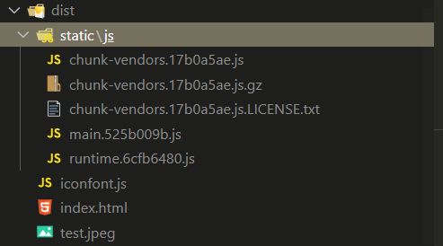
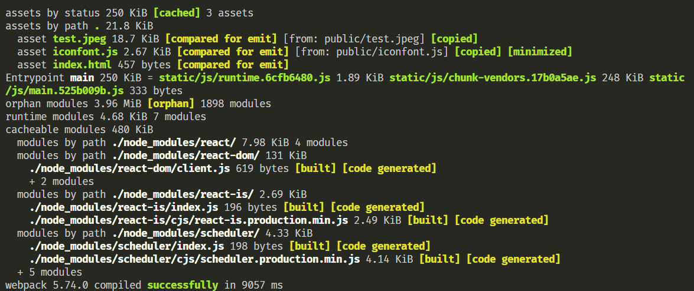
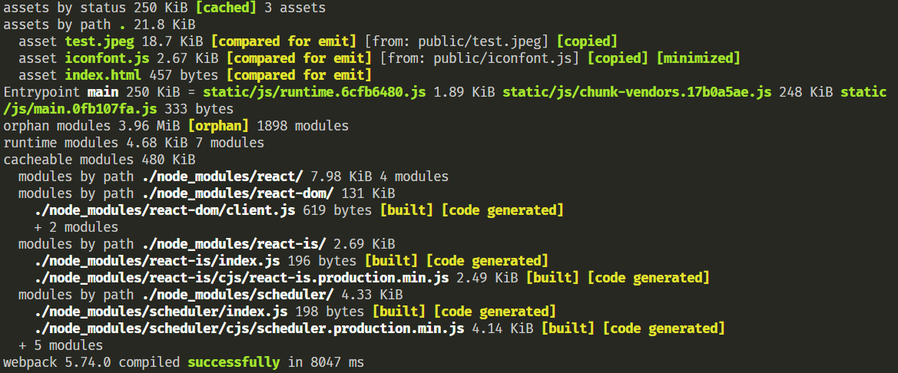
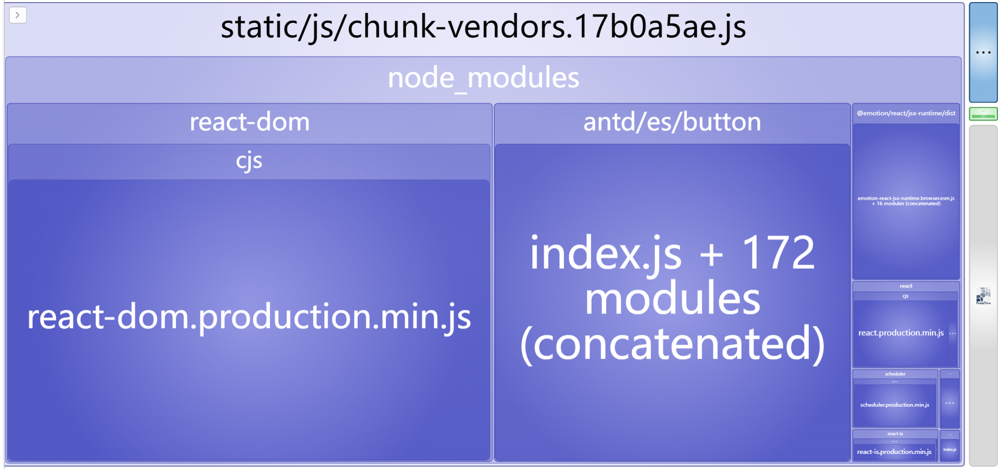
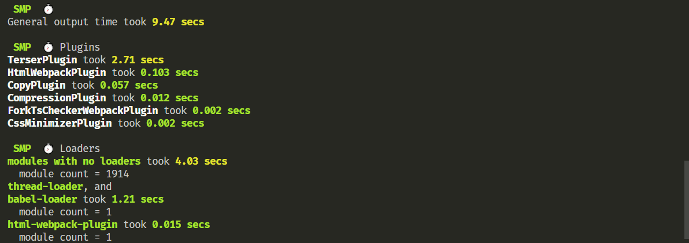

该小节介绍怎么配置 `react` 的生产环境打包
[点此处进入 github 仓库(注：该 react 环境仅是作者抱着学习的态度搭建，生产环境下谨慎使用)](https://github.com/violet180111/react_scaffold)

### **1. 安装依赖并编写 webpack 生产环境基本配置**

**终端执行 `npm i webpack webpack-cli thread-loader mini-css-extract-plugin css-minimizer-webpack-plugin copy-webpack-plugin compression-webpack-plugin -D`**

**在 `config` 下创建 `webpack.pro.conf.js`**

在 `package.json` 里面添加命令`"build": "cross-env NODE_ENV=production IS_GEN_BUNDLE=false IS_MEA_SPEED=false webpack --config config/webpack.prod.conf.js`

```
  ├──config
     ├──js
        ├──paths.js
        ├──utils.js
     ├──webpack.base.conf.js
     ├──webpack.dev.conf.js
     ├──webpack.pro.conf.js
  ├──public
     ├──index.html
  ├──src
     ├──index.tsx
  ├──.eslintrc.js
  ├──.prettierrc.js
  ├──babel.config.js
  ├──package.json
  ├──tsconfig.json
```

```js
// webpack.pro.conf.js
const { merge } = require('webpack-merge');
const threadLoader = require('thread-loader');
const MiniCssExtractPlugin = require('mini-css-extract-plugin');
const CssMinimizerPlugin = require('css-minimizer-webpack-plugin');
const TerserPlugin = require('terser-webpack-plugin');
const CopyPlugin = require('copy-webpack-plugin');
const CompressionPlugin = require('compression-webpack-plugin');
const baseWebpackConfig = require('./webpack.base.conf');
const { resolveDir, getCssRule, getTsRule } = require('./js/utils');
const paths = require('./js/paths');

/**
 * @description 获取webpack配置
 * @param mode - 指明是开发环境还是生产环境
 * @param module.rules - 模块构建规则
 * @param module.rules.test - 文件名匹配正则
 * @param module.rules.exclude - 要排除的文件
 * @param module.rules.use - 要使用的loader
 * @param plugins[1] - CompressionPlugin - 用于gizp压缩
 * @see https://github.com/webpack-contrib/compression-webpack-plugin
 * {
 *   test: 文件名匹配正则
 *   filename: 生成文件路径 + 文件名
 *   algorithm: 压缩格式,默认是gzip
 *   threshold: 只有大小大于该值的资源会被处理。默认值是 10k
 *   minRatio: 压缩率,默认值是 0.8
 * }
 * @param plugins[2] - CopyPlugin - 文件复制
 * @see https://github.com/webpack-contrib/copy-webpack-plugin
 * {
 *   from: 要copy的文件
 *   to: copy到哪里
 *   filter: 排除文件，
 * }
 * @param optimization.runtimeChunk - 将运行时代码单独打包成一个文件
 * @param optimization.minimize - 将告知 webpack 使用 TerserPlugin 或其它在 optimization.minimizer定义的插件压缩代码
 * @param optimization.minimizer - 允许你通过提供一个或多个定制过的 TerserPlugin 实例，覆盖默认压缩工具(minimizer)
 * @param optimization.minimizer[0] - CssMinimizerPlugin - 压缩css代码
 * @see https://github.com/webpack-contrib/css-minimizer-webpack-plugin
 * @param optimization.minimizer[1] - TerserPlugin - 压缩js代码
 * @see https://github.com/webpack-contrib/terser-webpack-plugin
 * {
 *   parallel: 开启多线程压缩
 *   terserOptions.compress.pure_funcs 删除某些代码例如 console.log
 * }
 * @param splitChunks.cacheGroups.common - 提取页面公共代码
 * @param splitChunks.cacheGroups.vendors - 提取node_modules代码
 * @param splitChunks.cacheGroups.xxx.name - 生成的文件名字
 * @param splitChunks.cacheGroups.xxx.chunks - 选择哪些 chunk 进行优化 一般写all 对同步和异步模块都进行抽离
 * @param splitChunks.cacheGroups.xxx.minChunks - 被引用的最小次数
 * @param splitChunks.cacheGroups.xxx.maxInitialRequests - 入口点的最大并行请求数。
 * @param splitChunks.cacheGroups.xxx.minSize - 生成 chunk 的最小体积
 * @param splitChunks.cacheGroups.xxx.priority - 提取优先级
 * @param splitChunks.cacheGroups.xxx.enforce - 忽略 splitChunks.minSize、splitChunks.minChunks、splitChunks.maxAsyncRequests 和 splitChunks.maxInitialRequests 选项，并始终为此缓存组创建 chunk
 * @param splitChunks.cacheGroups.xxx.reuseExistingChunk - 表示是否使用已有的 chunk，true 则表示如果当前的 chunk 包含的模块已经被抽取出去了，那么将不会重新生成新的
 * @param performance - webpack 如何通知「资源(asset)和入口起点超过指定文件限制」
 * @param performance.hints - 性能提示形式
 * @param performance.maxAssetSize - 根据单个资源体积(单位: bytes)，控制 webpack 生成性能提示
 * @param performance.maxEntrypointSize - 根据入口起点的最大体积，控制 webpack 生成性能提示
 */
/** @type {import('webpack').Configuration} wepack配置代码提示 */
let config = merge(baseWebpackConfig, {
  mode: 'production',
  module: {
    rules: [getCssRule(MiniCssExtractPlugin.loader)],
  },
  plugins: [
    new CompressionPlugin({
      test: /.(js|css)$/,
      filename: '[path][base].gz',
      algorithm: 'gzip',
      threshold: 50 * 1024,
    }),
    new CopyPlugin({
      patterns: [
        {
          from: paths.public,
          to: paths.output,
          filter: (source) => !source.includes('index.html'),
        },
      ],
    }),
    new ProgressBarPlugin({
      width: 40,
      isDev: false,
    }),
  ],
  optimization: {
    runtimeChunk: 'single',
    minimize: true,
    minimizer: [
      new CssMinimizerPlugin(),
      new TerserPlugin({
        parallel: true,
        terserOptions: {
          compress: {
            pure_funcs: ['console.log'],
          },
        },
      }),
    ],
    splitChunks: {
      chunks: 'all',
      cacheGroups: {
        common: {
          name: 'chunk-common',
          minChunks: 2,
          maxInitialRequests: 5,
          minSize: 0,
          priority: 1,
          enforce: true,
          reuseExistingChunk: true,
        },
        vendors: {
          name: 'chunk-vendors',
          test: /[\\/]node_modules[\\/]/,
          priority: 2,
          enforce: true,
          reuseExistingChunk: true,
        },
      },
    },
  },
  performance: {
    hints: 'warning',
    maxAssetSize: 2 * 1024 * 1024,
    maxEntrypointSize: 2 * 1024 * 1024,
  },
});

/**
 * @param plugins[0] - MiniCssExtractPlugin - 抽离css为单独文件 由于SpeedMeasurePlugin的某些bug，需要在smp.wrap执行后才能往plugins加MiniCssExtractPlugin（往后面看就行）
 * @see https://github.com/webpack-contrib/mini-css-extract-plugin
 * {
 *   filename: 生成文件路径 + 文件名
 * }
 */
const miniCssExtractPlugin = new MiniCssExtractPlugin({
  filename: 'static/css/[name].[contenthash:8].css',
});

config.plugins.unshift(miniCssExtractPlugin);

module.exports = config;
```

接下来尝试一下打包

在 **index.tsx** 中编写如下代码

```tsx
import ReactDOM from 'react-dom/client';
import { Button } from 'antd';

const root = ReactDOM.createRoot(document.getElementById('root') as HTMLElement);

root.render(<Button css={{ display: 'flex' }}>按钮</Button>);
```

然后终端执行 `npm run build`

打包成功后，可以看到如下结果





### 2. 开启多线程打包

终端执行 `npm i thread-loader -D`

在 **webpack.pro.conf.js** 中添加如下代码

```js
const threadLoader = require('thread-loader');

/**
 * @see https://github.com/webpack-contrib/thread-loader
 * @description 多进程打包构建
 * @param workers - 线程实例数量
 * @param workerParallelJobs - 每个线程可并发执行的最大任务数
 */
threadLoader.warmup(
  {
    workers: 2,
    workerParallelJobs: 50,
  },
  [
    // 子进程中需要预加载的 node 模块
    'babel-loader',
  ],
);
```

终端重新执行 `npm run build`



对比两次打包时间，可以看到第二次打包速度缩短了，当然效果没有太明显，因为我们这里要打包构建的文件并没有特别多，换到打包构建的文件特别多的场景下，效果会更加显著

### 3. 加入 webpack-bundle-analyzer 插件

终端执行 `npm i webpack-bundle-analyzer -D`

在 `package.json` 里面添加命令`"build:bundle": "cross-env NODE_ENV=production IS_GEN_BUNDLE=true webpack --config config/webpack.prod.conf.js", "analyz": "webpack-bundle-analyzer --port 8888 ./dist/stats.json"`

```js
// webpack.pro.conf.js
const BundleAnalyzerPlugin = require('webpack-bundle-analyzer').BundleAnalyzerPlugin;
const { IS_GEN_BUNDLE } = process.env;
const isGenAnalyz = JSON.parse(IS_GEN_BUNDLE ?? false);

if (isGenAnalyz) {
  /**
   * @param plugins[3] - BundleAnalyzerPlugin - 分析打包文件大小、占比情况、各文件 Gzipped 后的大小、模块包含关系、依赖项等
   * @see https://github.com/webpack-contrib/webpack-bundle-analyzer
   * {
   *   analyzerMode: 是否启动打包报告的http服务器
   *   generateStatsFile: 是否生成stats.json文件
   * }
   *
   */
  const BundleAnalyzerPlugin = require('webpack-bundle-analyzer').BundleAnalyzerPlugin;
  const bundleAnalyzerPlugin = new BundleAnalyzerPlugin({
    analyzerMode: 'disabled',
    generateStatsFile: true,
  });

  config.plugins.push(bundleAnalyzerPlugin);
}
```

终端执行 `npm run build:bundle`

可以看到 **dist** 文件夹下多了一个 **stats.json** 文件

终端执行 `npm run analyz`

可以清楚地看到如下的各个包体积分析结果



### 4. 加入 speed-measure-webpack-plugin 插件

终端执行 `npm i speed-measure-webpack-plugin -D`

在 `package.json` 里面添加命令`"build:speed": "cross-env NODE_ENV=production IS_MEA_SPEED=true  webpack --config config/webpack.prod.conf.js"`

```js
// webpack.pro.conf.js
const { IS_MEA_SPEED } = process.env;
const isMeaSpeed = JSON.parse(IS_MEA_SPEED ?? false);

/**
 * @param plugins[0] - MiniCssExtractPlugin - 抽离css为单独文件 由于SpeedMeasurePlugin的某些bug，需要在smp.wrap执行后才能往plugins加MiniCssExtractPlugin
 * @see https://github.com/webpack-contrib/mini-css-extract-plugin
 * {
 *   filename: 生成文件路径 + 文件名
 * }
 */
const miniCssExtractPlugin = new MiniCssExtractPlugin({
  filename: 'static/css/[name].[contenthash:8].css',
});

if (isMeaSpeed) {
  /**
   * @see https://github.com/stephencookdev/speed-measure-webpack-plugin/issues/167
   * @description 启用打包速度分析，测量打包各阶段耗时
   */
  const SpeedMeasurePlugin = require('speed-measure-webpack-plugin');
  const smp = new SpeedMeasurePlugin();
  config = smp.wrap(config);
}
```

终端执行 `npm run build:speed`

可以看到如下的打包输出信息



大功告成 🥳🥳🥳
