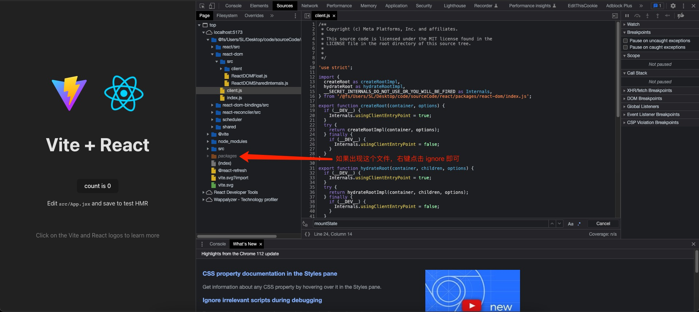

# react 源码调试教程

1. 先去 `GitHub` 上把 `react` 源码 `clone` 下来（下载压缩包也行）
2. 在 `react` 源码根目录下执行 `pnpm create vite`，创建一个 `react` 项目，然后进入该项目的终端，`pnpm i`，然后在 `vite.config.js`中加入如下代码：

   ```js
   import path from 'path';
   import { defineConfig } from 'vite';
   import react from '@vitejs/plugin-react';

   // https://vitejs.dev/config/
   export default defineConfig({
     plugins: [react()],
     define: {
       __DEV__: true, // 设置为 false 跳过 if(__dev__) 的开发逻辑
       __EXPERIMENTAL__: true,
       __PROFILE__: true,
     },
     // 我这里用的是 mac，win 可不加 posix
     resolve: {
       alias: {
         react: path.posix.resolve('../packages/react'),
         'react-dom': path.posix.resolve('../packages/react-dom'),
         'react-dom-bindings': path.posix.resolve('../packages/react-dom-bindings'),
         'react-reconciler': path.posix.resolve('../packages/react-reconciler'),
         scheduler: path.posix.resolve('../packages/scheduler'),
         shared: path.posix.resolve('../packages/shared'),
       },
     },
     // 我这里开的是 jsx 项目，需要加个 sourcemap 映射 esbuild 转换前的代码
     esbuild: {
       sourcemap: true,
     },
   });
   ```

   然后再在根目录下新建 `jsconfig.json` ，加入如下代码：

   ```json
   // vscode 方便 js 项目补全对应包的路径
   {
     "compilerOptions": {
       "baseUrl": "./",
       "paths": {
         "react/*": ["../packages/react/*"],
         "react-dom/*": ["../packages/react-dom/*"],
         "react-dom-bindings/*": ["../packages/react-dom-bindings/*"],
         "react-reconciler/*": ["../packages/react-reconciler/*"],
         "scheduler/*": ["../packages/scheduler/*"],
         "shared/*": ["../packages/shared/*"]
       }
     },
     "exclude": ["node_modules", "dist"]
   }
   ```

3. 修改 `react` 的代码，首先修改 `packages/react-reconciler/src/ReactFiberConfig.js`，如下：

   ```js
   // throw new Error('This module must be shimmed by a specific renderer.');
   // 也有可能是 export * from './forks/ReactFiberConfig.dom-browser';
   export * from './forks/ReactFiberConfig.dom';
   ```

   然后是 `packages/react/index.js`，加入 `React` 默认导出，代码如下：

   ```js
   /
    * Copyright (c) Meta Platforms, Inc. and affiliates.
    *
    * This source code is licensed under the MIT license found in the
    * LICENSE file in the root directory of this source tree.
    *
    * @flow
    */
   import * as React from './src/React';
   export default React;
   ```

   然后是 `packages/react-dom/client.js`，加入 `ReactDOM` 默认导出，代码如下：

   ```js
   // ...
   export default { createRoot, hydrateRoot };
   ```

   然后是 `packages/shared/ReactComponentStackFrame.js`

   ```js
   // import ReactSharedInternals from 'shared/ReactSharedInternals';
   import ReactSharedInternals from '../react/src/ReactSharedInternalsClient';
   ```

   还有一些类型代码需要我们手动去掉，这个得在运行的时候才能发现，根据自己的运行时报错解决即可

4. 因为 `react` 使用的 `flow` 语法限制类型，所以我们可以写成一个 `vite` 插件 `vite-plugin-flow`，去除类型并格式化代码，方便阅读。

   ```js
   // 你的项目文件夹名称/vitePlugins/flow.js
   import fs from 'fs';
   import flowRemoveTypes from 'flow-remove-types';
   import esbuildPluginFlow from '../esbuildPlugins/flow.js';

   export default function vitePluginFlow(filter = /\.js$/) {
     return {
       name: 'vite-plugin-flow',
       enforce: 'pre',

       config() {
         return {
           optimizeDeps: {
             esbuildOptions: {
               plugins: [esbuildPluginFlow()],
               sourcemap: true,
             },
           },
         };
       },
       transform(source, filePath) {
         if (filter.test(filePath)) {
           const output = flowRemoveTypes(source, { pretty: true });
           const code = output.toString();
           // const map = output.generateMap();

           // map.sources = [filePath];

           return {
             code,
             // map,
           };
         }
       },
     };
   }
   ```

   ```js
   // 你的项目文件夹名称/esbuildPlugins/flow.js
   import fs from 'fs';
   import flowRemoveTypes from 'flow-remove-types';

   export default function esbuildPluginFlow(filter = /\.js$/, force) {
     return {
       name: 'esbuild-plugin-flow',
       setup(build) {
         build.onLoad({ filter }, args => {
           const source = fs.readFileSync(args.path, 'utf8');
           const output = flowRemoveTypes(source, { pretty: true });
           const contents = output.toString();

           return {
             contents,
             loader: 'js',
           };
         });
       },
     };
   }
   ```

   ```js
   // vite.config.js
   // ...
   import { defineConfig } from 'vite';
   import react from '@vitejs/plugin-react';
   import flow from './vitePlugins/flow.js';
   // ...

   // https://vitejs.dev/config/
   export default defineConfig({
     plugins: [flow(), react()],
     // ...
   });
   ```

5. 执行 `pnpm run dev`（上面说过会出现类型报错，手动去除即可），看到如下界面即成功
   

   我们来打断点试试看

   
   

   可以看到断点已经成功进入真正的 `react` 源码

✨ 大功告成！！！✨
