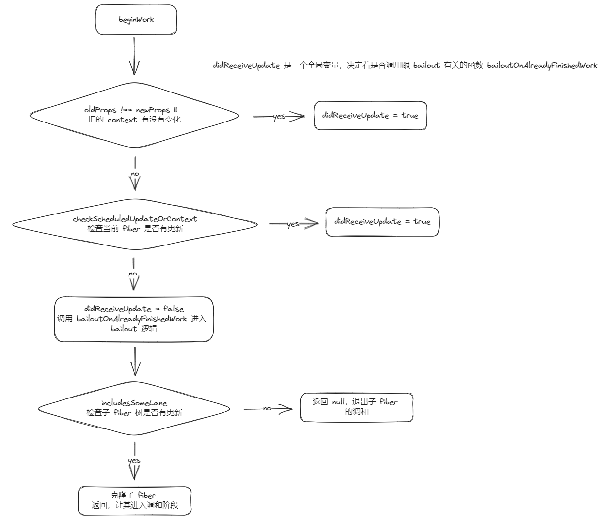

# EagerState & Bailout

> 注：本文使用的 `react` 版本为 `v18.2.0`，`EagerState & Bailout` 有关源码在 `/packages/react-reconciler/src/ReactFiberHooks.js -> dispatchSetState` | `/packages/react-reconciler/src/ReactBeginWork.js -> beginWork`

`React` 和 `Vue` 是目前前端圈子里比较火的框架，它们都使用了虚拟 `dom`，响应式，数据驱动 UI 等手段，但是它们的更新策略有所不同。`Vue` 使用模板语法来限制编写灵活性，但是这也带来了编译时的性能优化机会，使得 `Vue` 在运行时能够更轻松地找到哪个节点进行了更新。相反，`React` 使用 `JSX` 语法提高了灵活性，但是这也意味着在编译阶段失去了一些性能优化机会。因此，`React` 需要在运行时进行更多的性能优化，其中包括一些重要的策略，如 `eagerState` 和`bailout` 。特别是 `bailout` 策略，它可以在更新时避免不必要的计算和渲染，从而进一步提高 `React` 的运行时性能

## eagerState

`eagerState` 是使用在 `useState` 上的性能优化策略，其逻辑并不复杂，首先判断 `fiber` 上有没有待更新的 `lane`，没有就可以提前计算 `state` （有待更新的 `lane` 即有待处理的 `update` 对象，而 `state` 有可能是需要依赖之前 `update` 对象计算出来的，但是在 `dispatchSetState` 执行的时候我们并不能确定下一次更新的 `renderLane` 是什么，自然也就不能确定 `update` 的计算顺序了），如果计算出来的 `state` 与之前的 `state` 一样，那么就可以直接 `bailout` ，而不用等到 `useState` 执行的阶段再去比较（等到 `useState` 执行的阶段还要经历 `schedule、reconcile` 等比较长的调用路线），显然是极大地缩短了调用路线，达到了性能优化的目的

```js
function dispatchSetState(fiber, queue, action) {
  const lane = requestUpdateLane(fiber);
  const update = {
    lane,
    action,
    hasEagerState: false,
    eagerState: null,
    next: null,
  };

  if (isRenderPhaseUpdate(fiber)) {
    // render 阶段发生的更新
    // ...
  } else {
    const alternate = fiber.alternate;
    if (fiber.lanes === NoLanes && (alternate === null || alternate.lanes === NoLanes)) {
      // The queue is currently empty, which means we can eagerly compute the
      // next state before entering the render phase. If the new state is the
      // same as the current state, we may be able to bail out entirely.
      // currentFiber 和 workInProgressFiber 都没有待更新的 lane，这意味着可以在进入 render 阶段之前提前计算下一个 state。
      // 如果 newState 与 oldState 相同，我们或许能够 bailout
      const lastRenderedReducer = queue.lastRenderedReducer;
      if (lastRenderedReducer !== null) {
        try {
          const currentState = queue.lastRenderedState;
          const eagerState = lastRenderedReducer(currentState, action);
          // Stash the eagerly computed state, and the reducer used to compute
          // it, on the update object. If the reducer hasn't changed by the
          // time we enter the render phase, then the eager state can be used
          // without calling the reducer again.
          // 将提前计算的 state 和用来计算它的 reducer 保存在 update 对象上。
          // 如果在我们进入渲染阶段时 reducer 还没有改变，那么无需再次调用 reducer 就可以使用 eagerState
          update.hasEagerState = true;
          update.eagerState = eagerState;
          if (is(eagerState, currentState)) {
            // 此函数用于将不需要重新渲染的 update 放入队列。将它排队的唯一原因是为了防止后续的高优先级更新导致它被重新 base
            // TODO: 上面还没搞太明白，eagerState 和 currentState 都一样了，直接 base currentState 不就行 ?
            enqueueConcurrentHookUpdateAndEagerlyBailout(fiber, queue, update);
            return;
          }
        } catch (error) {
          // Suppress the error. It will throw again in the render phase.
        } finally {
          if (__DEV__) {
            ReactCurrentDispatcher.current = prevDispatcher;
          }
        }
      }
    }

    const root = enqueueConcurrentHookUpdate(fiber, queue, update, lane);
    if (root !== null) {
      scheduleUpdateOnFiber(root, fiber, lane);
      entangleTransitionUpdate(root, queue, lane);
    }
  }
}
```

## bailout

先来看一个例子

```jsx
import { useState } from 'react';

function Child1() {
  return (
    <div>
      {new Array(50000).fill(0).map((_, index) => (
        <span key={index}></span>
      ))}
    </div>
  );
}

function Child2() {
  const [count2, setCount2] = useState(0);

  return (
    <button
      onClick={() => {
        setCount2(1);
      }}
    >
      {count2}
    </button>
  );
}

function App() {
  return (
    <div>
      <Child1 />
      <Child2 />
    </div>
  );
}

export default App;
```

当我们点击 `Child2` 中的 `button` 时，改变了 `count2` 的值，毫无疑问 `Child2` 肯定是要进行调和的，那么 `Child1` 需不需要进行调和呢，显然是不需要的，所以 `bailout` 策略应运而生，它帮助 `react` 跳过没有更新任务的 `fiber` 子树的调和，直接进行复用，极大地提高了 `React` 的运行时性能

那么 `react` 要怎么知道某棵 `fiber` 子树没有更新，然后运用上 `bailout` 策略的呢？

`fiber` 身上有一个名为 `childLanes` 的属性，从名字我们也可以稍微猜到它的意义，就是某个 `fiber` 节点的子 `fiber` 树的 `lanes` 集合，在每次执行更新任务时都会执行一个叫 `markUpdateLaneFromFiberToRoot` 的方法，作用就是把发生更新的 `fiber` 的 `lane` 合并到祖先 `fiber` 的 `childLanes`，一直到根节点

```js
function markUpdateLaneFromFiberToRoot(sourceFiber, update, lane) {
  // 更新发生更新的 fiber lane
  sourceFiber.lanes = mergeLanes(sourceFiber.lanes, lane);
  let alternate = sourceFiber.alternate;
  if (alternate !== null) {
    alternate.lanes = mergeLanes(alternate.lanes, lane);
  }

  // 遍历祖先 fiber 一直到根节点并更新 childLanes
  let parent = sourceFiber.return;
  let node = sourceFiber;

  while (parent !== null) {
    parent.childLanes = mergeLanes(parent.childLanes, lane);
    alternate = parent.alternate;
    if (alternate !== null) {
      alternate.childLanes = mergeLanes(alternate.childLanes, lane);
    }

    // ...

    node = parent;
    parent = parent.return;
  }

  // ...
}
```

这下 `react` 就能很更加高效地找到发生更新的 `fiber` 了

接下来看正式进入跟 `bailout` 有关的逻辑（`didReceiveUpdate` 是一个全局变量，决定着是否调用跟 `bailout` 有关的函数 `bailoutOnAlreadyFinishedWork`）

命中 `bailout` 策略条件

- `props` 不变
- `legacy context` 没有改变（可忽略）
- 当前 `fiber` 没有更新
- 当前 `fiber` 的子 `fiber` 树也没有更新

```js
function beginWork(current, workInProgress, renderLanes) {
  // ...

  if (current !== null) {
    const oldProps = current.memoizedProps;
    const newProps = workInProgress.pendingProps;

    if (
      oldProps !== newProps ||
      // 这里暂时不用看，用了旧的废弃的 context api 才会返回 true
      hasLegacyContextChanged()
    ) {
      didReceiveUpdate = true;
    } else {
      // prop 相等
      const hasScheduledUpdateOrContext = checkScheduledUpdateOrContext(current, renderLanes);
      if (
        !hasScheduledUpdateOrContext &&
        // If this is the second pass of an error or suspense boundary, there
        // may not be work scheduled on `current`, so we check for this flag.
        // 如果这是 error boundary 或 suspense boundary 的第二遍调和，则可能其对应的 fiber 上没有更新，这时候不应该 bailout
        // 因为 error boundary 或 suspense boundary 都是需要展示对应 feedback UI 的
        (workInProgress.flags & DidCapture) === NoFlags
      ) {
        // 没有待执行的更新，则 bailout
        didReceiveUpdate = false;
        // attemptEarlyBailoutIfNoScheduledUpdate 主要执行了 bailoutOnAlreadyFinishedWork 函数
        return attemptEarlyBailoutIfNoScheduledUpdate(current, workInProgress, renderLanes);
      }

      // ...
    }
  } else {
    didReceiveUpdate = false;
  }

  // ...
}
```

`checkScheduledUpdateOrContext`：`props` 相等执行这个方法，检查当前 `fiber` 或者 `context` 是否有更新，不过由于 `enableLazyContextPropagation` 还未启用，现在只能检查当前 `fiber` 是否有更新，有兴趣的可以自行了解，有关的 [PR](https://github.com/facebook/react/issues/20890)

```js
function checkScheduledUpdateOrContext(current, renderLanes) {
  const updateLanes = current.lanes;
  // includesSomeLane 就是判断当前 fiber 的 lane 是否在本次更新的 lanes 集合中
  // (updateLanes & renderLanes) !== NoLanes
  if (includesSomeLane(updateLanes, renderLanes)) {
    return true;
  }

  if (enableLazyContextPropagation) {
    // enableLazyContextPropagation 目前还是 false，这里的逻辑还未启用，有兴趣的可以自行了解
    const dependencies = current.dependencies;
    if (dependencies !== null && checkIfContextChanged(dependencies)) {
      return true;
    }
  }

  return false;
}
```

`attemptEarlyBailoutIfNoScheduledUpdate` 主要执行的了 `bailoutOnAlreadyFinishedWork` 函数

```js
function bailoutOnAlreadyFinishedWork(current, workInProgress, renderLanes) {
  if (current !== null) {
    // Reuse previous dependencies
    workInProgress.dependencies = current.dependencies;
  }

  markSkippedUpdateLanes(workInProgress.lanes);

  // 检查子 fiber 树是否有更新
  if (!includesSomeLane(renderLanes, workInProgress.childLanes)) {
    // 子 fiber 树没有更新，可以跳过它们

    if (enableLazyContextPropagation && current !== null) {
      // 未启用的逻辑
      lazilyPropagateParentContextChanges(current, workInProgress, renderLanes);
      if (!includesSomeLane(renderLanes, workInProgress.childLanes)) {
        return null;
      }
    } else {
      // 子 fiber 树没有更新，返回 null，这样子 fiber 树就不会进入 beginWork 的流程了
      return null;
    }
  }

  // 当前 fiber 没有更新，但是子 fiber 树有更新，则克隆子 fiber 节点返回，让子 fiber 节点进入 beginWork 的流程
  cloneChildFibers(current, workInProgress);
  return workInProgress.child;
}
```



然后 `updateFunctionComponent` 里面还有这么一段逻辑

```js
if (current !== null && !didReceiveUpdate) {
  bailoutHooks(current, workInProgress, renderLanes);
  return bailoutOnAlreadyFinishedWork(current, workInProgress, renderLanes);
}
```

前面 `beginWork` 不是判断过是否命中 `bailout` 逻辑了吗，为什么这里还要判断呢 ? 原因是有更新，并不代表 `state` 会发生变化，对于 `FunctionComponent` 我们需要执行 `useState` 之后才能知道 `state` 有没有发生变化

`updateState` 里面有这么一段逻辑

```js
if (!is(newState, hook.memoizedState)) {
  // didReceiveUpdate = true
  markWorkInProgressReceivedUpdate();
}
```

当 `state` 发生变化时，`didReceiveUpdate` 为 `true` ，使得 `renderWithHook` 执行完之后不会命中 `bailout` 策略

除了 `beginWork` 开头里面存在 `bailout` 策略有关逻辑之外，部分性能优化 `API` 也有

`React.memo`

部分相关逻辑如下（`updateMemoComponent`）：

```js
const prevProps = currentChild.memoizedProps;
let compare = Component.compare;
compare = compare !== null ? compare : shallowEqual;
if (compare(prevProps, nextProps) && current.ref === workInProgress.ref) {
  // 默认浅比较 props && ref 不变
  return bailoutOnAlreadyFinishedWork(current, workInProgress, renderLanes);
}
```

前面 `beginWork` 中 `props` 的比较是全等比较，这里是浅比较，显然这里更容易命中 `bailout` 策略

`PureComponent & shouldComponentUpdate`

部分相关逻辑如下（`checkShouldComponentUpdate` - `beginWork -> updateClassComponent -> updateClassInstance -> checkShouldComponentUpdate`）：

```js
function checkShouldComponentUpdate(
  workInProgress,
  ctor,
  oldProps,
  newProps,
  oldState,
  newState,
  nextContext,
) {
  const instance = workInProgress.stateNode;
  // shouldComponentUpdate 的优先级比 PureComponent 高
  if (typeof instance.shouldComponentUpdate === 'function') {
    let shouldUpdate = instance.shouldComponentUpdate(newProps, newState, nextContext);

    return shouldUpdate;
  }
  // extends 了 PureComponent，prototype 就会存在 isPureReactComponent 标志
  if (ctor.prototype && ctor.prototype.isPureReactComponent) {
    return !shallowEqual(oldProps, newProps) || !shallowEqual(oldState, newState);
  }

  return true;
}
```

`shouldUpdate` 就决定了是否命中 `bailout` 策略

```js
if (!shouldUpdate && !didCaptureError) {
  return bailoutOnAlreadyFinishedWork(current, workInProgress, renderLanes);
}
```

最后来讲一下跟 `context` 有关的 `bailout` 策略

`updateProvider`：

```js
function updateContextProvider(current, workInProgress, renderLanes) {
  // ...

  if (enableLazyContextPropagation) {
    // In the lazy propagation implementation, we don't scan for matching
    // consumers until something bails out, because until something bails out
    // we're going to visit those nodes, anyway. The trade-off is that it shifts
    // responsibility to the consumer to track whether something has changed.
    // 在惰性传播实现中，我们不会扫描匹配的 consumers，直到某些东西 bailout，因为在 bailout 之前，
    // 无论如何都要访问那些 fiber 节点。这样做的代价是，将跟踪是否发生了变化的责任转移给了 consumers。
  } else {
    if (oldProps !== null) {
      const oldValue = oldProps.value;
      if (is(oldValue, newValue)) {
        // context 的 value 没有改变，bailout
        if (oldProps.children === newProps.children && !hasLegacyContextChanged()) {
          return bailoutOnAlreadyFinishedWork(current, workInProgress, renderLanes);
        }
      } else {
        // context 的值改变了，搜索匹配的 consumers 并调度它们更新
        propagateContextChange(workInProgress, context, renderLanes);
      }
    }
  }

  // ...
}
```

`propagateContextChange`：

```js
function propagateContextChange(workInProgress, context, renderLanes) {
  if (enableLazyContextPropagation) {
    // enableLazyContextPropagation 目前还是 false，这里的逻辑还未启用，有兴趣的可以自行了解
    const forcePropagateEntireTree = true;
    propagateContextChanges(workInProgress, [context], renderLanes, forcePropagateEntireTree);
  } else {
    propagateContextChange_eager(workInProgress, context, renderLanes);
  }
}
```

`propagateContextChange_eager`：这个函数的作用就是从 `Provider` 根节点往下遍历，找到消费了该 `Provider` 的 `context` 的子 `fiber` ，标记更新

```js
function propagateContextChange_eager(workInProgress, context, renderLanes) {
  // Only used by eager implementation
  if (enableLazyContextPropagation) {
    return;
  }
  let fiber = workInProgress.child;
  if (fiber !== null) {
    // 保持连接
    fiber.return = workInProgress;
  }

  // 深度优先遍历
  while (fiber !== null) {
    let nextFiber;

    // dependencies 是一个 context 链表，fiber 消费(useContext、Consumer、contextType)的 context 都在上面
    const list = fiber.dependencies;
    if (list !== null) {
      nextFiber = fiber.child;

      let dependency = list.firstContext;
      while (dependency !== null) {
        // 检查是否有匹配的 context
        if (dependency.context === context) {
          // 匹配! 调度更新
          if (fiber.tag === ClassComponent) {
            // 如果是 ClassComponent，标记 ForceUpdate
            // ShouldComponentUpdate 即使返回 false 也能进行更新
            const lane = pickArbitraryLane(renderLanes);
            const update = createUpdate(lane);
            update.tag = ForceUpdate;
            // ...
          }

          // ...

          // 合并 lane 到祖先 fiber 的 childLanes，类似 markUpdateLaneFromFiberToRoot
          scheduleContextWorkOnParentPath(fiber.return, renderLanes, workInProgress);

          // 在 context list 中也标记 renderLanes。
          list.lanes = mergeLanes(list.lanes, renderLanes);

          // 找到了匹配项，我们可以停止遍历 context list
          break;
        }
        dependency = dependency.next;
      }
    } else if (fiber.tag === ContextProvider) {
      // 相同的 Provider 嵌套，交由层级更低的 Provider 接管
      nextFiber = fiber.type === workInProgress.type ? null : fiber.child;
    } else if (fiber.tag === DehydratedFragment) {
      // ...
    } else {
      // 继续往下遍历
      nextFiber = fiber.child;
    }

    if (nextFiber !== null) {
      // 保持连接
      nextFiber.return = fiber;
    } else {
      // 没有直接子 fiber 了，遍历兄弟 fiber
      nextFiber = fiber;
      while (nextFiber !== null) {
        if (nextFiber === workInProgress) {
          // 都遍历完了 退出内外的 while 循环
          nextFiber = null;
          break;
        }
        const sibling = nextFiber.sibling;
        if (sibling !== null) {
          // 保持连接
          sibling.return = nextFiber.return;
          nextFiber = sibling;
          break;
        }
        // 没有兄弟 fiber 了，返回父 fiber
        nextFiber = nextFiber.return;
      }
    }

    fiber = nextFiber;
  }
}
```

当组件层级过深时，以上的深度优先遍历肯定是比较费时的，所以上面提到的有关 `context` 的 `PR` 个人猜测就是为了提高 `context` 性能的

参考资料

- [context 源码解析](https://github.com/lizuncong/mini-react/blob/master/docs/ReactContext/context%E6%BA%90%E7%A0%81%E8%A7%A3%E6%9E%90.md)

- [《React 设计原理》(卡颂)](https://item.jd.com/13576643.html)
