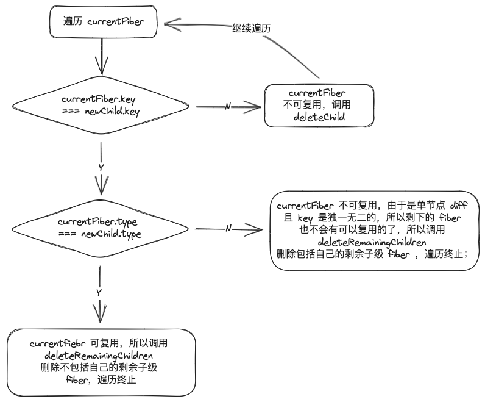
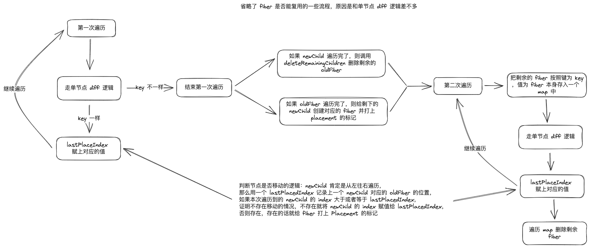

# React Diff Algorithm

> 注：本文使用的 react 版本为 v18.2.0，diff 算法所在的文件路径：/packages/react-reconciler/src ReactChildFiber.js

众所周知，`react` 有三大流程 `schedule -> reconcile -> commit`

- `schedule` ：决定 `react` 以一个什么样的优先级进行本次的更新任务
- `reconcile` ：根据状态变化计算出 `UI（virtual dom）` 的变化
- `commit` ：讲 `UI（virtual dom）` 的变化渲染到页面上

今天要讲的就是 `diff` 算法就是处于 `reconcile` 阶段，首先我们可以到[这里](https://legacy.reactjs.org/docs/reconciliation.html#the-diffing-algorithm)大体了解 `react diff` 的设计理念

> `diff` 是 `newChild` （`ReactElement`）和 `currentFiber`（页面上已经渲染的 `dom` 对应的 `fiber`） 的 对比

`diff` 算法可以分成单节点 `diff` 和 多节点 `diff`

- 单节点 `diff`（`newChild` 不是数组）

  - `deleteRemainingChildren`：遍历剩余的子级 `fiber` ，调用 `deleteChild`

    ```js
    function deleteRemainingChildren(returnFiber, currentFirstChild) {
      if (!shouldTrackSideEffects) {
        return null;
      }

      let childToDelete = currentFirstChild;
      while (childToDelete !== null) {
        deleteChild(returnFiber, childToDelete);
        childToDelete = childToDelete.sibling;
      }
      return null;
    }
    ```

  - `deleteChild`：把要删除 `fiber` 放入父级 `fiber` 的 `deletions` 中并给父级 `fiber` 打上 `ChildDeletion` 的标记

    ```js
    function deleteChild(returnFiber, childToDelete) {
      if (!shouldTrackSideEffects) {
        return;
      }
      const deletions = returnFiber.deletions;
      if (deletions === null) {
        returnFiber.deletions = [childToDelete];
        returnFiber.flags |= ChildDeletion;
      } else {
        deletions.push(childToDelete);
      }
    }
    ```

  > 注意上面两个 `deleteXXX` 的方法都不是真正的删除，无论是 `fiber` 还是 `dom` 节点，`fiber` 节点的删除其实是在 `workInProgress.child = (reconcile 产生的新的子 fiber) 中`，这样原本旧的 `fiber` 就没有被引用了，就会被 `GC`；`dom` 节点的删除在 `commit` 阶段，找到有 `ChildDeletion` 标记的 `fiber`，根据 `deletions` 数组就可以真正地删除。下面在提到这两个方法时所说的删除也不是真正的删除，大家知道即可

  - `reconcileSingleElement`

    ```js
    function reconcileSingleElement(returnFiber, currentFirstChild, element, lanes) {
      const key = element.key;
      let child = currentFirstChild;
      while (child !== null) {
        if (child.key === key) {
          const elementType = element.type;
          if (elementType === REACT_FRAGMENT_TYPE) {
            // fragment 相关
            // ...
          } else {
            if (child.elementType === elementType) {
              // key & type 相同，可以复用，删除不包括自己的剩余子级 fiber
              deleteRemainingChildren(returnFiber, child.sibling);

              const existing = useFiber(child, element.props);

              existing.ref = coerceRef(returnFiber, child, element);
              existing.return = returnFiber;

              return existing;
            }
          }
          // key 相同，type 不同，不可以复用，删除包括自己的剩余子级 fiber
          deleteRemainingChildren(returnFiber, child);
          break;
        } else {
          // key 不同，不可以复用，删除自己
          deleteChild(returnFiber, child);
        }
        child = child.sibling;
      }

      // 创建新的 fiber
      if (element.type === REACT_FRAGMENT_TYPE) {
        // fragment 相关
        // ...
      } else {
        const created = createFiberFromElement(element, returnFiber.mode, lanes);

        created.return = returnFiber;

        return created;
      }
    }
    ```

    开始遍历 `currentFiber` ，

    - `currentFiber.key !== newChild.key` ，则代表 `currentFiber` 不可复用,调用 `deleteChild` 删除 `currentFiber`，然后继续遍历；

    - `currentFiber.key === newChild.key && currentFiber.type !== newChild.type` ，则表示 `currentFiber` 不可复用，由于是单节点 `diff` 且 `key` 是独一无二的，所以剩下的 `fiber` 也不会有可以复用的了，所以调用 `deleteRemainingChildren` 删除包括自己的剩余子级 `fiber` ，遍历终止；

    - `currentFiber.key === newChild.key && currentFiber.type === newChild.type` 则证明可以复用 `currentFiber`，由于是单节点 `diff` ，所以调用 `deleteRemainingChildren` 删除不包括自己的剩余子级 `fiber` ，遍历终止；

    

- 多节点 `diff`

  - `updateSlot`

    ```js
      function updateSlot(
        returnFiber,
        oldFiber,
        newChild,
        lanes,
      ) {
        const key = oldFiber !== null ? oldFiber.key : null;

        if (
          (typeof newChild === 'string' && newChild !== '') ||
          typeof newChild === 'number'
        ) {
          // text 类的 node key 应该为 null
          if (key !== null) {
            return null;
          }
          return updateTextNode(returnFiber, oldFiber, '' + newChild, lanes);
        }

        if (typeof newChild === 'object' && newChild !== null) {
          switch (newChild.$$typeof) {
            case REACT_ELEMENT_TYPE: {
              // 和单节点 dff 逻辑差不多
              if (newChild.key === key) {
                return updateElement(returnFiber, oldFiber, newChild, lanes);
              } else {
                return null;
              }
            }
          }

          // fragment 相关
          if (isArray(newChild) || getIteratorFn(newChild)) {
            if (key !== null) {
              return null;
            }

            return updateFragment(returnFiber, oldFiber, newChild, lanes, null);
          }

          return null;
        }
    ```

  - `updateFromMap`

    ```js
    function updateFromMap(existingChildren, returnFiber, newIdx, newChild, lanes) {
      if ((typeof newChild === 'string' && newChild !== '') || typeof newChild === 'number') {
        // text node 没有 key， 用 newChild 的 index 作为 key
        const matchedFiber = existingChildren.get(newIdx) || null;
        return updateTextNode(returnFiber, matchedFiber, '' + newChild, lanes);
      }

      if (typeof newChild === 'object' && newChild !== null) {
        switch (newChild.$$typeof) {
          case REACT_ELEMENT_TYPE: {
            const matchedFiber =
              existingChildren.get(
                // 有就用，没有就用 newChild 的 index 作为 key
                newChild.key === null ? newIdx : newChild.key,
              ) || null;
            return updateElement(returnFiber, matchedFiber, newChild, lanes);
          }
        }

        // fragment 相关
        if (isArray(newChild) || getIteratorFn(newChild)) {
          const matchedFiber = existingChildren.get(newIdx) || null;
          return updateFragment(returnFiber, matchedFiber, newChild, lanes, null);
        }
      }

      // key 不等或者 newChild 为假值就会 return null
      return null;
    }
    ```

  - `placeChild`

    ```js
    function placeChild(newFiber, lastPlacedIndex, newIndex) {
      newFiber.index = newIndex;
      // 是否应该追踪副作用，区分 mount 和 update
      if (!shouldTrackSideEffects) {
        return lastPlacedIndex;
      }

      const current = newFiber.alternate;
      // current !== null 证明，fiber 可以复用，之前有现在也有，此时才可以进行判断移动的逻辑
      if (current) {
        const oldIndex = current.index;

        if (oldIndex < lastPlacedIndex) {
          // 移动，打上 Placement 标记
          newFiber.flags |= Placement;
        } else {
          lastPlacedIndex = oldIndex;
        }
      } else {
        // mount 不用考虑移动
        newFiber.flags |= Placement;
      }

      return lastPlacedIndex;
    }
    ```

  - `reconcileChildrenArray`

    ```js
    function reconcileChildrenArray(returnFiber, currentFirstChild, newChildren, lanes) {
      // 多节点 diff 后返回的第一个子级 fiber
      let resultingFirstChild = null;
      // 一个连接兄弟 fiber 的指针变量
      let previousNewFiber = null;

      let oldFiber = currentFirstChild;
      // 上一个 newChild 对应的 oldFiber 的位置
      let lastPlacedIndex = 0;
      // newChild 的 index
      let newIdx = 0;
      // 用于跳过假值 null undefined false etc.
      // <>{null}{undefined}{false}<span>1</span></>
      let nextOldFiber = null;
      // 遍历 oldFiber
      for (; oldFiber !== null && newIdx < newChildren.length; newIdx++) {
        if (oldFiber.index > newIdx) {
          nextOldFiber = oldFiber;
          oldFiber = null;
        } else {
          nextOldFiber = oldFiber.sibling;
        }

        // 这里其实就是节点进行 diff 的逻辑
        const newFiber = updateSlot(returnFiber, oldFiber, newChildren[newIdx], lanes);
        // key 不等或者 newChild 为假值 newFiber 就会为 null
        // 然后 break 出第一次循环
        if (newFiber === null) {
          if (oldFiber === null) {
            oldFiber = nextOldFiber;
          }
          break;
        }
        // 是否应该追踪副作用，区分 mount 和 update
        if (shouldTrackSideEffects) {
          // newFiber.alternate === null 证明是 newChild.type !== oldFiber.type
          // 创建了新的 fiber
          if (oldFiber && newFiber.alternate === null) {
            deleteChild(returnFiber, oldFiber);
          }
        }
        // lastPlacedIndex 赋值相关逻辑，上面解释过
        lastPlacedIndex = placeChild(newFiber, lastPlacedIndex, newIdx);
        if (previousNewFiber === null) {
          resultingFirstChild = newFiber;
        } else {
          previousNewFiber.sibling = newFiber;
        }
        previousNewFiber = newFiber;
        oldFiber = nextOldFiber;
      }

      // newChild 遍历完
      if (newIdx === newChildren.length) {
        deleteRemainingChildren(returnFiber, oldFiber);
        return resultingFirstChild;
      }

      // oldFiber 遍历完
      if (oldFiber === null) {
        for (; newIdx < newChildren.length; newIdx++) {
          const newFiber = createChild(returnFiber, newChildren[newIdx], lanes);
          if (newFiber === null) {
            continue;
          }
          lastPlacedIndex = placeChild(newFiber, lastPlacedIndex, newIdx);
          if (previousNewFiber === null) {
            resultingFirstChild = newFiber;
          } else {
            previousNewFiber.sibling = newFiber;
          }
          previousNewFiber = newFiber;
        }

        return resultingFirstChild;
      }

      // 剩余的 oldFiber 存入 map 中
      const existingChildren = mapRemainingChildren(returnFiber, oldFiber);

      for (; newIdx < newChildren.length; newIdx++) {
        const newFiber = updateFromMap(
          existingChildren,
          returnFiber,
          newIdx,
          newChildren[newIdx],
          lanes,
        );
        if (newFiber !== null) {
          if (shouldTrackSideEffects) {
            if (newFiber.alternate !== null) {
              existingChildren.delete(newFiber.key === null ? newIdx : newFiber.key);
            }
          }
          lastPlacedIndex = placeChild(newFiber, lastPlacedIndex, newIdx);
          if (previousNewFiber === null) {
            resultingFirstChild = newFiber;
          } else {
            previousNewFiber.sibling = newFiber;
          }
          previousNewFiber = newFiber;
        }
      }

      if (shouldTrackSideEffects) {
        // 删除剩余 oldFiber
        existingChildren.forEach((child) => deleteChild(returnFiber, child));
      }

      return resultingFirstChild;
    }
    ```

  - 与单节点 `diff` 不一样的一个地方是，多节点 `diff` 存在节点移动的情况，那么怎么判断是否存在节点移动的情况呢，答案是 `newChild` 肯定是从左往右遍历，那么用一个 `lastPlacedIndex` 记录上一个 `newChild` 对应的 `oldFiber` 的位置，如果本次遍历到的 `newChild` 的 `index` 大于或者等于 `lastPlacedIndex`，证明不存在移动的情况，不存在就将`newChild` 的 `index` 赋值给 `lastPlacedIndex`，否则存在，存在的话就给 `fiber` 打上 `Placement` 的标记

  - 多节点 `diff` 存在两次遍历

    - 第一次遍历的是 `oldFiber`，这时候的逻辑就可以看做单节点 `diff` ，不一样的地方是如果 `key` 不同，单节点 `diff` 会直接终止遍历，直接创建新的 `fiber`，而多节点 `diff` 是终止第一次遍历，把剩余的 `fiber` 按照键为 `key` ，值为 `fiber` 本身存入一个 `map` 中（便于直接通过 `key` 拿对应的 `fiber`），然后就开启第二次遍历；如果 `key` 一样就按照上面所说的逻辑给 `lastPlaceIndex` 赋上对应的值

      第一次遍历终止后会进行两个逻辑的判断，如果满足任意一种情况都会结束函数调用

      - 如果 `newChild` 遍历完了，则调用 `deleteRemainingChildren` 删除剩余的 `oldFiber`

      - 如果 `oldFiber` 遍历完了，则给剩下的 `newChild` 创建对应的 `fiber` 并打上 `placement` 的标记

    - 第二次遍历的是 `newChild`，如果在 `map` 没有找到对应 `fiber` 就直接创建新 `fiber` ，找到了就按照单节点 diff 的逻辑往下走，`lastPlaceIndex` 赋值逻辑同上

    遍历结束后需要再遍历一下记录 `fiber` 的 `map` ，删除剩余的 fiber
    多节点 diff 可能有点难理解，这里举个例子说明:

    ```plain
    变化前 a, b, c, d
    变化后 c, a, e
    ------------------------------------------------------------------
    第一次循环:
    lastPlaceIndex = 0;
    newIdx = 0;
    ------------------------------------------------------------------
    遍历 oldFiber
    ------------------------------------------------------------------
    a ==> 对比 a-c, key 不一样 ==> 退出第一次循环
    ------------------------------------------------------------------
    existingChildren:
    {
      a <==> a 对应的 fiber,
      b <==> b 对应的 fiber,
      c <==> c 对应的 fiber,
      d <==> d 对应的 fiber
    }
    ------------------------------------------------------------------
    第二次循环:
    lastPlaceIndex = 0;
    newIdx = 0;
    ------------------------------------------------------------------
    遍历 newChild
    ------------------------------------------------------------------
    c ==> map 中有 c 对应的 fiber oldIndex(c 对应的 fiber.index 为 2) > lastPlaceIndex ==> lastPlaceIndex = oldIndex; newIdx++;
    ------------------------------------------------------------------
    此时
    lastPlaceIndex = 2;
    newIdx = 1;
    a ==> map 中有 c 对应的 fiber oldIndex(c 对应的 fiber.index 为 0) < lastPlaceIndex ==> newFiber.flags |= Placement;
    ------------------------------------------------------------------
    此时
    lastPlaceIndex = 2;
    newIdx = 2;
    e ==> map 中没有 e 对应的 fiber ==> newFiber.flags |= Placement;
    ------------------------------------------------------------------
    此时
    lastPlaceIndex = 2;
    newIdx = 3;
    existingChildren:
    {
      b <==> b 对应的 fiber,
      d <==> d 对应的 fiber
    }
    ------------------------------------------------------------------
    if (shouldTrackSideEffects) {
        existingChildren.forEach((fiber) => {
            deleteChild(returnFiber, fiber);
        });
    }
    ```

    

参考资料

- [react 调和源码](https://github.com/facebook/react/blob/main/packages/react-reconciler/src/ReactChildFiber.js)
- [《React 设计原理》(卡颂)](https://item.jd.com/13576643.html)
