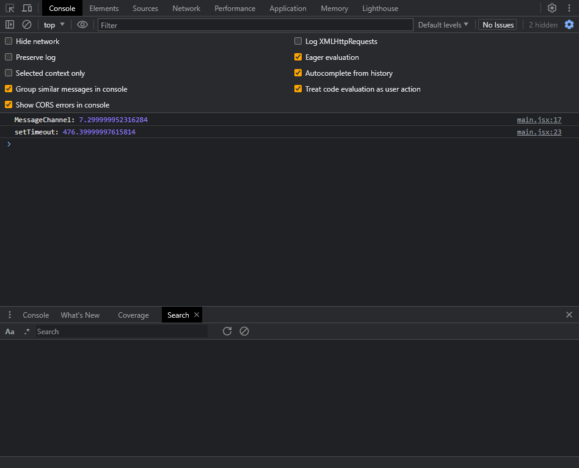
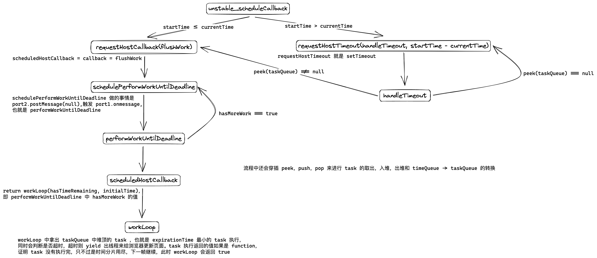

# Scheduler

> 注：本文使用的`react`版本为`v18.2.0`，`Scheduler`所在的文件路径：`/packages/scheduler/Scheduler.js`

`react`进行一次更新会涉及到三个阶段，分别是`schedule -> reconcile -> commit`，`scheduler`便是在`schedule`阶段发挥作用，`react`里面的时间分片，高优先级`task`打断低优先级`task`都是与它有关系，`scheduler`这个包与`react`并不耦合，可独立使用。

首先，解释一下文件中的一些关键变量

```js
// Max 31 bit integer. The max integer size in V8 for 32-bit systems.
// Math.pow(2, 30) - 1
// 0b111111111111111111111111111111
// 32 位系统下 V8 的最大整数
var maxSigned31BitInt = 1073741823;

//  task 最多可以被拖延多久执行（根据优先级决定），因为高优先级 task 打断低优先级 task 的存在，
// 我们不能让部分优先级没这么低的 task 一直被打断，超过了这个最大拖延时间
//  task 就会被传入一个参数 didUserCallbackTimeout 来标志这个任务已经超时
// IMMEDIATE_PRIORITY_TIMEOUT 为同步优先级对应的延迟时间（ms）
// -1 很显然是不能延迟要马上同步执行
var IMMEDIATE_PRIORITY_TIMEOUT = -1;
var USER_BLOCKING_PRIORITY_TIMEOUT = 250;
var NORMAL_PRIORITY_TIMEOUT = 5000;
var LOW_PRIORITY_TIMEOUT = 10000;
// 可以拖延到永远
var IDLE_PRIORITY_TIMEOUT = maxSigned31BitInt;

// 小根堆（这里就不解释堆是什么了，不懂请自行百度）
// taskQueue 代表可以被立即执行的 task 队列，按照 task.expirationTime 进行排列，值越小排得越前面
// timerQueue 代表需要延迟执行的 task 队列，按照 task.startTime 进行排列，也是值越小排得越前面
// timerQueue 中的 task 到点后会通过 advanceTimers 这个函数转移到 taskQueue 中
var taskQueue: Array<Task> = [];
var timerQueue: Array<Task> = [];

// isPerformingWork 和 isHostCallbackScheduled 都是用于防止重新执行 task，因为 task 里面有
// 有可能还会执行 unstable_scheduleCallback
var isPerformingWork = false;
var isHostCallbackScheduled = false;
// 判断当前是否有定时器在计时，用于保证只有一个定时器在执行
var isHostTimeoutScheduled = false;

// 防止请求多个帧去开启多个 task 循环，因为后续 task 会自动按序请求帧去执行，保证堆中的 task 可被执行完
// 例如当调用 requestHostCallback 时需要使用到 messageChannel，在下次事件循环才能执行 task，
// 但是如果在下次事件循环前，我们再次调用 unstable_scheduleCallback ，
// unstable_scheduleCallback 里面又调用 requestHostCallback，此时就是请求多个帧
let isMessageLoopRunning = false;
// 会被复制为 flushWork
let scheduledHostCallback:
  | null
  | ((hasTimeRemaining: boolean, initialTime: DOMHighResTimeStamp | number) => boolean) = null;
let taskTimeoutID: TimeoutID = (-1: any);

// 一个 task 的时间，fiber 调和会被分成多个 task 进行
let frameInterval = frameYieldMs;
// 下面的变量只有在 enableIsInputPending (navigator.scheduling.isInputPending) 为 true 时才会用到
// 但是 enableIsInputPending 目前兼容性还不够好，所以暂时未启用
const continuousInputInterval = continuousYieldMs;
const maxInterval = maxYieldMs;
let needsPaint = false;

// 每个 task 开始执行的时间和 task.startTime 不一样，用来计算一个 task 执行了多久
// 是否应该让出线程
let startTime = -1;
```

接下来是关键函数

1. `unstable_scheduleCallback`：`Scheduler`的入口函数，也是`Scheduler`最关键的部分，简单来说就是以某个优先级去调度一个函数，`react`原本是在`packages/react-reconciler/src/ReactFiberWorkLoop -> ensureRootIsScheduled`中使用该函数进行调度更新，现在移至`packages/react/reconciler/src/ReactFiberWorkLoop/ReactFiberRootScheduler.js -> scheduleTaskForRootDuringMicrotask`（[具体的 PR](https://github.com/facebook/react/pull/26512)）

   ```js
   function unstable_scheduleCallback(
     priorityLevel: PriorityLevel,
     callback: Callback,
     options?: { delay: number },
   ): Task {
     var currentTime = getCurrentTime();

     // 一个 task 的开始时间，因为可传第三个参数 options.delay，所以有了 timeQueue 和 taskQueue
     var startTime;
     if (typeof options === 'object' && options !== null) {
       var delay = options.delay;
       if (typeof delay === 'number' && delay > 0) {
         startTime = currentTime + delay;
       } else {
         startTime = currentTime;
       }
     } else {
       startTime = currentTime;
     }

     var timeout;
     // 上面有说，根据优先级设置最大拖延时间，过了这个时间必须同步执行即不能被打断
     switch (priorityLevel) {
       case ImmediatePriority:
         timeout = IMMEDIATE_PRIORITY_TIMEOUT;
         break;
       case UserBlockingPriority:
         timeout = USER_BLOCKING_PRIORITY_TIMEOUT;
         break;
       case IdlePriority:
         timeout = IDLE_PRIORITY_TIMEOUT;
         break;
       case LowPriority:
         timeout = LOW_PRIORITY_TIMEOUT;
         break;
       case NormalPriority:
       default:
         timeout = NORMAL_PRIORITY_TIMEOUT;
         break;
     }

     var expirationTime = startTime + timeout;

     var newTask: Task = {
       id: taskIdCounter++,
       callback,
       priorityLevel,
       startTime,
       expirationTime,
       sortIndex: -1,
     };

     // 与 option.delay 有关
     if (startTime > currentTime) {
       // 这是一个延迟执行的 task
       newTask.sortIndex = startTime;
       push(timerQueue, newTask);
       if (peek(taskQueue) === null && newTask === peek(timerQueue)) {
         // 如果有定时器（该定时器对应的 timerQueue 中的 task 肯定是最先执行的）在执行，
         // 则取消，因为进入该 if 分支证明 newTask 应该变成最早被执行的延时 task 了
         if (isHostTimeoutScheduled) {
           cancelHostTimeout();
         } else {
           isHostTimeoutScheduled = true;
         }
         // 调度一个定时器，延迟 delay 毫秒将 task 从 timeQueue 转移到 taskQueue
         // requestHostTimeout 可以认为是 setTimeout
         requestHostTimeout(handleTimeout, startTime - currentTime);
       }
     }
     // 有要被立即执行的 task
     else {
       newTask.sortIndex = expirationTime;
       push(taskQueue, newTask);

       if (!isHostCallbackScheduled && !isPerformingWork) {
         isHostCallbackScheduled = true;
         requestHostCallback(flushWork);
       }
     }

     return newTask;
   }
   ```

2. `requestHostCallback`：向浏览器请求一帧，执行`task`

   ```js
   function requestHostCallback(
     callback: (hasTimeRemaining: boolean, initialTime: number) => boolean,
   ) {
     // callback 就是 flushWork
     scheduledHostCallback = callback;
     // 防止请求多个帧去开启多个 task 循环
     if (!isMessageLoopRunning) {
       isMessageLoopRunning = true;
       schedulePerformWorkUntilDeadline();
     }
   }
   ```

3. `schedulePerformWorkUntilDeadline`：调度`task`执行，简单说就是在下一次事件循坏执行`task`，让出主线程给浏览器去渲染页面

   这里涉及到宏任务的选择，满足条件的备选项应该在一帧时间（这里的一帧时间是指浏览器更新一次页面的时间）内可以执行多次，并且执行时机越早越好

   - [为什么不用 requestIdleCallback](https://github.com/facebook/react/pull/8833)

     这是一个实验性质的`API`，在每顿的空闲时期执行，但它的如下缺点使得`Scheduler`放弃使用它来实现。
     浏览器兼容性。

     - 执行频率不稳定，受很多因素影响
       比如当切换浏览器`Tab`后，之前`Tab`注册的`rIC`的频率会大幅降低

     - 应用场景局限 `rIC`的设计初衷是“能够在事件循环中执行低优先级工作，减少对动画、用户输入等高优先级事件的影响”。这意味着`rIC`的应用场被局限在 “低优先级工作” 中这与`Scheduler`中 “多种优先级的调度策略” 不符。

   - [为什么不使用 requestAnimationFrame](https://github.com/facebook/react/pull/16214)

     `requestAnimationFrame`(简称`rAF`)。该`API`义的调数会在浏览器下次`Paint`，一般用于更新动画。由于`rAF`的执行取决于“每一 帧`Paint`前的时机”，即“它的执行与帧相关”，执行频率并不高，因此`Scheduler`也没有选择它。

   - [为什么不使用 generator](https://github.com/facebook/react/issues/7942)

   - [为什么不使用 web worker](https://github.com/facebook/react/issues/3092)

   - 为什么不使用`setTimeout`，因为`setTimeout`嵌套层级越深延迟越明显，看下面的例子就能体会到差异了

     ```js
     const start = performance.now();
     const channel = new MessageChannel();

     let i = 0;
     let j = 0;

     channel.port2.postMessage(null);

     channel.port1.onmessage = () => {
       i === 100 ? console.log(performance.now() - start) : channel.port2.postMessage(null), i++;
     };

     function fn() {
       j === 100 ? console.log(performance.now() - start) : setTimeout(fn, 0), j++;
     }

     fn();
     ```

     

     正常浏览器的刷新频率是`60 Hz`也就是`16.66 ms`刷新一次，如果嵌套过深导致延迟过高，那么就会造成页面掉帧，用户体验会很差，因此`Scheduler`也没有选择它

   - 为什么不使用微任务，因为微任务在一次事件循环中会被全部清空，这可能会阻塞浏览器更新页面

     ```js
     let schedulePerformWorkUntilDeadline;
     if (typeof localSetImmediate === 'function') {
       // Node 环境下使用 setImmediate
       // 相比于 MessageChannel 的优点是
       // 1.它不会阻止 Node.js 退出
       // 2.执行时机更早
       schedulePerformWorkUntilDeadline = () => {
         localSetImmediate(performWorkUntilDeadline);
       };
     } else if (typeof MessageChannel !== 'undefined') {
       const channel = new MessageChannel();
       const port = channel.port2;
       channel.port1.onmessage = performWorkUntilDeadline;
       schedulePerformWorkUntilDeadline = () => {
         port.postMessage(null);
       };
     } else {
       // MessageChannel 不支持时才用 setTimeout 兜底
       schedulePerformWorkUntilDeadline = () => {
         localSetTimeout(performWorkUntilDeadline, 0);
       };
     }
     ```

4. `performWorkUntilDeadline`：每一帧中被调度的主函数

   ```js
   const performWorkUntilDeadline = () => {
     if (scheduledHostCallback !== null) {
       const currentTime = getCurrentTime();
       // 上面有提及，这里的 startTime 不是 task.startTime
       // 这里的 startTime 是用来计算 task 的执行时间，用来判断是否需要让出线程
       startTime = currentTime;

       const hasTimeRemaining = true;

       // 判断还有没有 task，有可能一帧里同一个 task 没执行完，也有可能是 taskQueue 里还有任务
       let hasMoreWork = true;
       try {
         hasMoreWork = scheduledHostCallback(hasTimeRemaining, currentTime);
       } finally {
         if (hasMoreWork) {
           // 再向浏览器请求一帧去执行 task
           schedulePerformWorkUntilDeadline();
         } else {
           isMessageLoopRunning = false;
           scheduledHostCallback = null;
         }
       }
     } else {
       isMessageLoopRunning = false;
     }
   };
   ```

5. `flushWork`：`task`循环发起者，里面的逻辑其实很简单，关键在`workLoop`这个函数

   ```js
   function flushWork(hasTimeRemaining: boolean, initialTime: number) {
     isHostCallbackScheduled = false;
     // 走到这里证明 task 已经开始执行了
     // 取消掉定时器，执行 workLoop 的过程会穿插 advanceTimers 保证 timerQueue
     // 中的 task 一定能够被放入 taskQueue
     if (isHostTimeoutScheduled) {
       isHostTimeoutScheduled = false;
       cancelHostTimeout();
     }

     isPerformingWork = true;
     const previousPriorityLevel = currentPriorityLevel;
     try {
       return workLoop(hasTimeRemaining, initialTime);
     } finally {
       // 重置状态
       currentTask = null;
       currentPriorityLevel = previousPriorityLevel;
       isPerformingWork = false;
     }
   }
   ```

6. `workLoop`：拿出`taskQueue`中堆顶的`task`，也就是`expirationTime`最小的`task`执行，同时会判断是否超时，超时则让出线程来给浏览器更新页面

   > `Scheduler`涉及到两个循环，一个是`ensureRootIsScheduled`（涉及到`scheduleCallback`、`performConcurrentWorkOnRoot`等方法）特点是：调度优先级最高的任务的执行，一个就在`Scheduler`本身（涉及到`requestHostCallback`、`scheduledHostCallback`、`workLoop`等方法）特点是：反复调度`task`执行

   ```js
   function workLoop(hasTimeRemaining: boolean, initialTime: number) {
     let currentTime = initialTime;
     // timerQueue -> taskQueue
     advanceTimers(currentTime);
     // 去除 expirationTime 最小的 task
     currentTask = peek(taskQueue);
     while (currentTask !== null && !(enableSchedulerDebugging && isSchedulerPaused)) {
       if (currentTask.expirationTime > currentTime && (!hasTimeRemaining || shouldYieldToHost())) {
         // This currentTask hasn't expired, and we've reached the deadline
         // 翻译过来的意思是 currentask 还没有到期，我们已经到达了截止日期
         // 就是 task 没到期，但是一帧里面允许 js 代码执行的时间到达上限，需要让出线程了
         // 这里体现了 Scheduler 的时间分片思想
         break;
       }
       // react-reconcile 里面就是 performConcurrentWorkOnRoot
       const callback = currentTask.callback;
       if (typeof callback === 'function') {
         currentTask.callback = null;
         currentPriorityLevel = currentTask.priorityLevel;
         // 判断 task 是否过期
         const didUserCallbackTimeout = currentTask.expirationTime <= currentTime;
         const continuationCallback = callback(didUserCallbackTimeout);
         currentTime = getCurrentTime();
         if (typeof continuationCallback === 'function') {
           // callback 返回一个 function 证明 task 没执行完
           // 只不过是时间分片用尽，下一帧继续，除非有更高优先级的任务进来
           currentTask.callback = continuationCallback;
           advanceTimers(currentTime);
           // hasMoreWork
           return true;
         } else {
           // task 执行完了，出队
           if (currentTask === peek(taskQueue)) {
             pop(taskQueue);
           }
           advanceTimers(currentTime);
         }
       } else {
         // callback 为空，出队
         pop(taskQueue);
       }
       currentTask = peek(taskQueue);
     }
     if (currentTask !== null) {
       return true;
     } else {
       // 假如 taskQueue 和 timerQueue 都进了一个 task
       // 由 unstable_scheduleCallback 的逻辑可知，如果 taskQueue 不为空
       // 是不会执行 requestHostTimeout 来进行 timerQueue -> taskQueue 的转换
       // 所以才有了下面的逻辑，执行完一个 task 后，如果 taskQueue 为空
       // 并且 timerQueue 中还有 task，那我们就再创建一个定时器
       // 取出 timerQueue 中最早过期的 task，用 setTimeout 延迟相应的时间放入 taskQueue
       const firstTimer = peek(timerQueue);
       if (firstTimer !== null) {
         requestHostTimeout(handleTimeout, firstTimer.startTime - currentTime);
       }
       return false;
     }
   }
   ```

7. `advanceTimers`：一句话解释就是`timerQueue -> taskQueue`

   ```js
   function advanceTimers(currentTime: number) {
     let timer = peek(timerQueue);
     while (timer !== null) {
       if (timer.callback === null) {
         // 可能 callback 传入的时候就是 null
         // 也可能是调用了 cancelCallback 使得 task.callback = null
         // 提前出队，没必要进入后续的调度流程
         pop(timerQueue);
       } else if (timer.startTime <= currentTime) {
         // 超过了 delay 毫秒，timerQueue -> taskQueue
         pop(timerQueue);
         timer.sortIndex = timer.expirationTime;
         push(taskQueue, timer);
       } else {
         return;
       }
       timer = peek(timerQueue);
     }
   }
   ```

8. `shouldYieldToHost`：判断是否应该让出线程

   ```js
   function shouldYieldToHost(): boolean {
     const timeElapsed = getCurrentTime() - startTime;
     if (timeElapsed < frameInterval) {
       // 主线程只被阻塞了很短的时间; 比一帧小。先别让出线程
       return false;
     }

     // 下面的代码 react 还未启用，原因是 navigator.scheduling.isInputPending 兼容性不好

     // 主线程已经被阻塞了一段不可忽略的时间。我们可能希望放弃主线程的控制权
     // 这样浏览器就可以执行高优先级的任务。主要是绘制和用户输入。
     // 如果有未完成的绘制或未完成的输入，则应该让出线程
     // 但如果两者都不存在，那么我们可以在保持响应的同时减少让步的次数。
     // 无论如何，我们最终都会让出线程，因为可能存在未调用 requestPaint 的挂起的 paint
     // 或者其他主线程任务，如网络事件。
     if (enableIsInputPending) {
       if (needsPaint) {
         // 有一个 paint 等待中 (由 requestPaint 标记)，马上让出线程
         // requestPaint 会在 commitRootImpl 中被调用
         return true;
       }
       if (timeElapsed < continuousInputInterval) {
         // 我们没有阻塞线程那么长时间。只有在有待处理的 discrete input (例如 click )时才 yield。
         // 如果有待处理的 continuous input (例如 mouseover)也没关系。
         // isInputPending 就是 navigator.scheduling.isInputPending，作用是
         // 检查是否有 input 事件（包括: input 框输入事件, 点击事件等）正在被调度
         if (isInputPending !== null) {
           return isInputPending();
         }
       } else if (timeElapsed < maxInterval) {
         // 如果有待定的 discrete 或 continuous input，则 yield。
         if (isInputPending !== null) {
           return isInputPending(continuousOptions);
         }
       } else {
         // 我们把这个线程阻塞了很长时间。即使没有待处理的输入，
         // 也可能有一些我们不知道的其他安排的工作，例如网络事件。马上让出线程
         return true;
       }
     }

     // isInputPending 不可用。马上让出线程。
     return true;
   }
   ```

9. `handleTimeout`：这里值得注意的是在这个函数开头调用了`advanceTimers`，又因为`handleTimeout`一般是当`taskQueue`中没有`task`，需要调度一个定时器来让`timerQueue`中的`task`进入`taskQueue`，按道理来说执行了`advanceTimers` 后 `taskQueue`肯定会有`task`，为什么还要`peek(taskQueue) !== null`，原因上面解释`advanceTimers`的时候有提到，因为`task.callback`可能为空，所以`timerQueue`不一定会有`task`进入`taskQueue`中

   ```js
   function handleTimeout(currentTime: number) {
     isHostTimeoutScheduled = false;
     advanceTimers(currentTime);

      // 如果已经请求了帧，但是还没到下一次事件循环，此时定时器到时间了，
      // isHostCallbackScheduled 就是 true，此时就没有必要再执行下面的逻辑
     if (!isHostCallbackScheduled) {
       // 判断 taskQueue 的堆顶有无 task
       if (peek(taskQueue) !== null) {
         isHostCallbackScheduled = true;
         requestHostCallback(flushWork);
       } else {
         const firstTimer = peek(timerQueue);
         if (firstTimer !== null) {
           requestHostTimeout(handleTimeout, firstTimer.startTime - currentTime);
         }
       }
     }
   }
   ```

总结：`Scheduler`首先通过`unstable_scheduleCallback`按照优先级将`task`入队，然后通过`requestHostCallback`开启`task`循环，在下一帧通过`flushWork`中的`workLoop`产生一个`while`循环来不断对`task`进行处理，`workLoop`中还会穿插`advanceTimers`来保证`taskQueue -> timerQueue`的转换，使得所有的`task`都能够有条不紊地被执行



参考资料

- [Scheduler 源码](https://github.com/facebook/react/tree/main/packages/scheduler)

- [《React 设计原理》(卡颂)](https://item.jd.com/13576643.html)

拓展：[卡颂大佬的 100 行代码的简易 schedule 阶段实现](https://codesandbox.io/s/xenodochial-alex-db74g)
