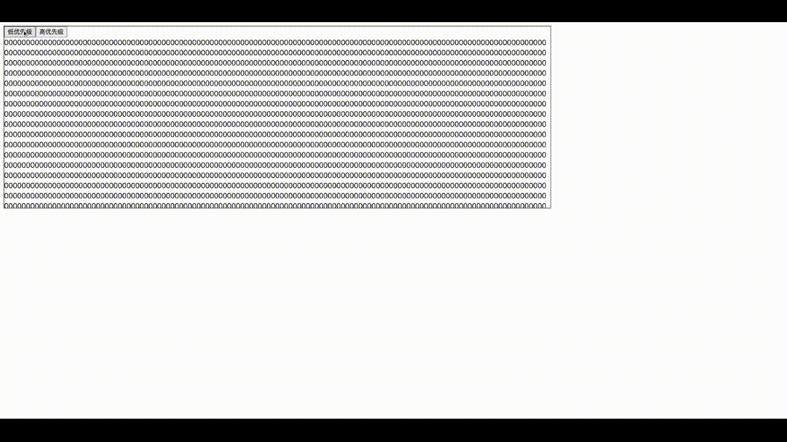
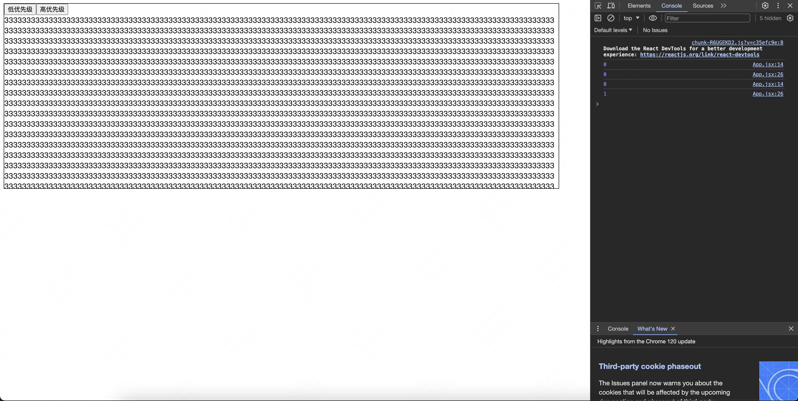
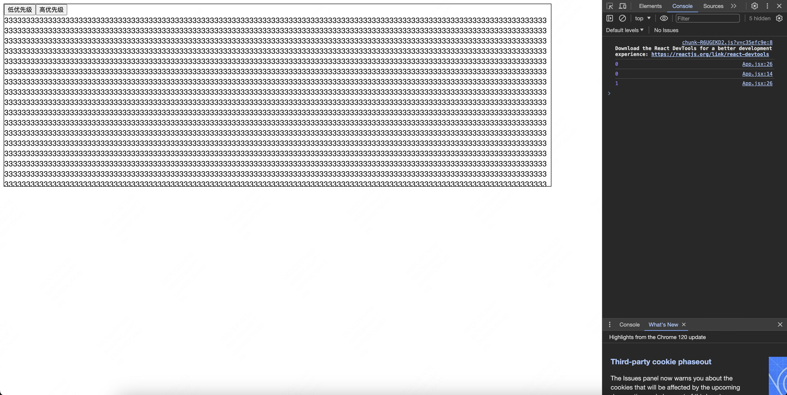
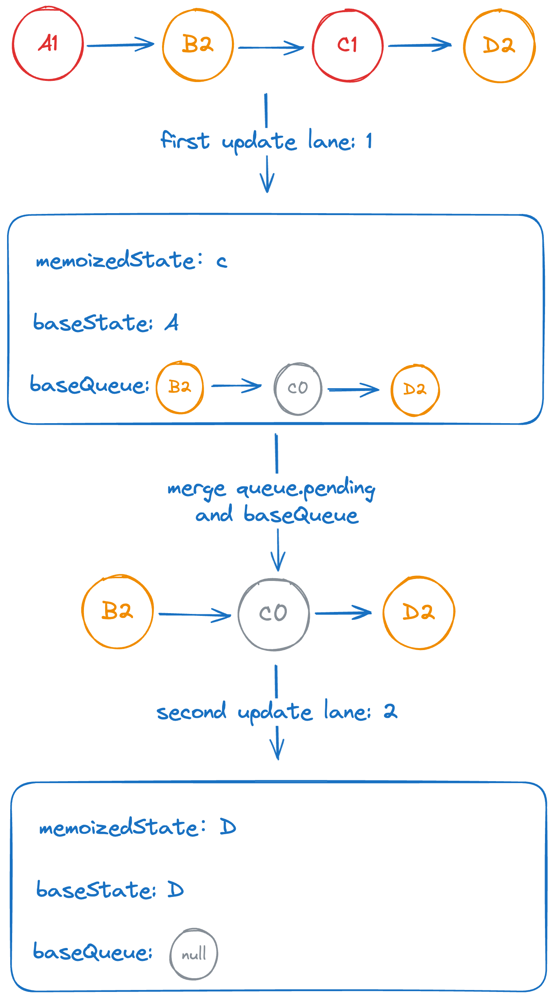

# State Calculation under Concurrent Updates

> 注：本文使用的 `react` 版本为 `v18.2.0`，并发更新下的状态计算所在的文件路径：`/packages/react-reconciler/src/ReactFiberHooks.js` | `/packages/react-reconciler/src/ReactFiberClassUpdateQueue.js`，分别对应函数组件和类组件，下面以函数组件进行讲解

并发模式是 `react 16` 中引入的新特性（[最早叫做异步模式，后来 react 团队为了避免与其他异步渲染方法的混淆而更名](https://github.com/facebook/react/pull/13732)），它通过使用新的 `fiber` 架构来实现，随之带来的功能有时间分片和优先级调度等，值得一提的是虽然这些特性在 `react 16` 就已经存在，但是一直都是以不稳定的特性存在（`react 18` 才稳定下来），所以在 `react 18` 之前包括 `react 18` 都没有默认开启（`react 18` 中可以通过 `useTransition` 开启），而今天要讲的状态计算就与优先级有关

首先来看一个例子 --- [🔗](https://stackblitz.com/edit/stackblitz-starters-1xwq9t?file=src%2FApp.js)

```css
/* App.css */
.container {
  overflow-y: auto;
  border: 1px solid #000000;
  width: 1200px;
  height: 400px;
  word-break: break-all;
}
```

```jsx
// App.jsx
import { useState, useTransition } from 'react';
import './App.css';

function App() {
  const [count, setCount] = useState(0);
  const [_, startTransition] = useTransition();

  return (
    <div className="container">
      <button
        onClick={() => {
          startTransition(() => {
            setCount((preCount) => {
              console.log(preCount);

              return preCount + 1;
            });
          });
        }}
      >
        低优先级
      </button>
      <button
        onClick={() => {
          setCount((preCount) => {
            console.log(preCount);

            return preCount + 2;
          });
        }}
      >
        高优先级
      </button>
      <br />
      {new Array(100000).fill(0).map((_, index) => {
        return <span key={index}>{count}</span>;
      })}
    </div>
  );
}
export default App;
```

点击低优先级按钮后再点击高优先级按钮（动作稍微快点）



通过上面的图片我们可以很清楚的看到，数字是从 `0 -> 2 -> 3` 而不是 `0 -> 1 -> 3` ，原因就是被 `startTransition` 包裹的更新属于低优先级更新，会被后面的高优先级更新打断，通过这个例子我们能很好地体会到 `react` 快速响应用户的理念

还有一些可以值得思索的地方，在第一次高优先级更新任务执行完之后，第二次恢复执行低优先级更新任务高优先级 `update` 还需不需要参与计算，还是直接基于高优先级 `update` 计算出的状态继续更新呢，还是看上面的代码，`setCount` 里面都加了 `console.log` ，控制台里面输出的是 `0 0 0 1`，第一个 `0` 是 `startTransition` 中的 `setCount` 产生的 `update` ，也就是低优先级 `update` 参与计算输出的，第二个 `0` 是高优先级 `update` 参与计算输出的 ，后面的 `0 1` 证明了第二次恢复执行低优先级更新任务两个 `update` 都需要参与计算，保证了最终的结果与预期的一致。



这里还有一个有趣的点，试着点击低优先级按钮后**迅速**再点击高优先级（动作再快一些），你会发现输出变了，咋回事呢，读者可以停下来想想（提示一下：回忆一下 `useTransition` 的实现）



```js
function startTransition(setPending, callback, options) {
  // ...

  // 此处的 setPending 产生高优先级 update
  setPending(true);
  // 计算优先级时，会根据 ReactCurrentBatchConfig.transition 是否 null 来判断是否应该返回 transitionLane
  ReactCurrentBatchConfig.transition = {};

  // ...

  try {
    // 此处的 setPending 产生低优先级 update
    setPending(false);
    // startTransition 传入的回调
    callback();
  } finally {
    // ...
  }
}
```

从 `useTransition` 的实现我们可以发现里面存在两个 `setPending`，关键就在第一个 `setPending`，第一个 `setPending` 属于高优先级更新，它会先开始执行一轮更新任务，在这个更新任务期间我们迅速点击了高优先级按钮，又产生了另一个高优先级 `update`，也就是 `setCount` 对应的高优先级 `update`，待到执行完第一个 `setPending` 对应的更新任务后，会通过 `scheduler` 调度会复用上一次的高优先级任务，此时的低优先级 `setCount` 就不会再开启更新了（即低优先级 `update` 不会参与计算，不会输出任何内容），所以第一个 `0` 的输出是高优先级 `setCount` 对应的 `update` 对象参与计算产生的，后续输出的 `0 1`，就跟之前的逻辑一样，恢复执行低优先级更新产生的

总结一下，`0 0 1` 和 `0 0 0 1` 的区别就是在哪个阶段点击高优先级按钮，如果处于 `setPending` 对应高优先级任务执行的过程，输出 `0 0 1`，如果处于 `setCount` 对应低优先级任务执行的过程，输出 `0 0 0 1`

OK 言归正传，这里 `react` 解决了两个问题

1. 保证优先级的情况下又能保证 `update` 依赖的连续性
2. 多次更新中保持 `update` 不丢失

那么第一个问题， `react` 是怎么做的在既保证优先级的情况下又能保证 `update` 依赖的连续性呢，让我们来分析一下：

首先是每次更新都有一个优先级，只有优先级足够的 `update` 对象才会参与本次更新的状态计算，

然后来看一下 `useState hook` 对应的数据结构

```ts
type Hook = {
  // 保存着 hook 的状态值，比如 useState 保存的就是
  // const [state, setState] = useState(); 中的 state
  memoizedState: any;
  // 保存着第一个被跳过的 update 对象的前一个 update 对象计算出来的值
  baseState: any;
  // 保存着第一个被跳过的 update 对象以及后面的 update 对象的一条环状链表
  baseQueue: Update<any, any> | null;
  queue: any;
  next: Hook | null;
};
```

`baseState baseQueue` 代表的意义可能有点难理解，下面举个例子说明

```plain
假如现在我们有一条 update 链表如下 queue.pending：
字母代表 state，数字代表优先级（越小优先级越高）
A1 -> B2 -> C1 -> D2
目前有两种优先级的 update 要处理
第一次更新优先级：1
A1、C1 参与计算
B2、D2 被跳过
本次更新结束时
memoizedState: C
baseState: A
baseQueue: B2 -> C0 -> D2 (C 的优先级变成 0 的原因是 0 代表 NoLane， 属于任何 lanes 集合，这样下次更新时肯定能参与到状态计算中)
第二次更新优先级：2
B2 -> C0 -> D2 参与计算
本次更新结束时
memoizedState: D
baseState: D
baseQueue: null
```

用一个流程图表示可能更容易理解



`updateReducer`：`update` 计算的主要逻辑

```js
function updateReducer(reducer, initialArg, init) {
  const hook = updateWorkInProgressHook();
  const queue = hook.queue;

  queue.lastRenderedReducer = reducer;

  const current = currentHook;

  let baseQueue = current.baseQueue;

  // 待处理的 update 对象链表
  const pendingQueue = queue.pending;
  if (pendingQueue !== null) {
    // 存在待处理的 update 对象
    if (baseQueue !== null) {
      // 合并 pendingQueue 和 baseQueue
      const baseFirst = baseQueue.next;
      const pendingFirst = pendingQueue.next;
      baseQueue.next = pendingFirst;
      pendingQueue.next = baseFirst;
    }
    current.baseQueue = baseQueue = pendingQueue;
    queue.pending = null;
  }

  if (baseQueue !== null) {
    // 合并完之后存在要处理 update 对象

    // baseQueue 中第一个 update 对象
    const first = baseQueue.next;
    let newState = current.baseState;

    // 要赋给 baseState 的值
    let newBaseState = null;
    // 如果存在跳过的 update 对象，那么就需要保存跳过的 update 对象以及后面的 update 对象
    // 从名字也可以看出来，新的 baseQueue 的第一个节点
    let newBaseQueueFirst = null;
    // 新的 baseQueue 的最后一个节点
    let newBaseQueueLast = null;
    let update = first;
    do {
      // 这里简化了一些逻辑
      const updateLane = update.lane;
      // 判断 update 优先级是否在本次的 lanes 集合中
      const shouldSkipUpdate = !isSubsetOfLanes(renderLanes, updateLane);

      if (shouldSkipUpdate) {
        // update 优先级不够
        // 克隆一下 update
        const clone = {
          lane: updateLane,
          action: update.action,
          hasEagerState: update.hasEagerState,
          eagerState: update.eagerState,
          next: null,
        };
        // 形成环状 baseQueue 的逻辑
        if (newBaseQueueLast === null) {
          newBaseQueueFirst = newBaseQueueLast = clone;
          // newBaseQueueLast === null 代表还没有 update 对象被跳过
          // 所以这里的 newState 就是第一个被跳过的 update 对象的前一个 update 对象计算出来的值
          newBaseState = newState;
        } else {
          newBaseQueueLast = newBaseQueueLast.next = clone;
        }
      } else {
        // update 优先级足够

        if (newBaseQueueLast !== null) {
          const clone = {
            // NoLane 的原因上面解释过了
            lane: NoLane,
            action: update.action,
            hasEagerState: update.hasEagerState,
            eagerState: update.eagerState,
            next: null,
          };
          newBaseQueueLast = newBaseQueueLast.next = clone;
        }

        // 处理 update
        const action = update.action;
        if (update.hasEagerState) {
          // eagerState 是 react 中性能优化策略，这里不深究
          newState = update.eagerState;
        } else {
          newState = reducer(newState, action);
        }
      }
      update = update.next;
    } while (update !== null && update !== first);

    if (newBaseQueueLast === null) {
      // 不存在被跳过的 update 对象
      // memoizedState 等于 baseState
      newBaseState = newState;
    } else {
      newBaseQueueLast.next = newBaseQueueFirst;
    }

    if (!is(newState, hook.memoizedState)) {
      // 新旧 state 不一样，标记更新是否进入 bailout 逻辑，
      // bailout 逻辑也是 react 中的性能优化策略，这里不深究
      markWorkInProgressReceivedUpdate();
    }

    // 更新结束，赋值
    hook.memoizedState = newState;
    hook.baseState = newBaseState;
    hook.baseQueue = newBaseQueueLast;

    queue.lastRenderedState = newState;
  }

  if (baseQueue === null) {
    queue.lanes = NoLanes;
  }

  const dispatch = queue.dispatch;
  return [hook.memoizedState, dispatch];
}
```

通过上面我们已经知道了 `react` 怎么做到既保证优先级的情况下又能保证 `update` 对象的依赖的连续性，那么还剩最后一个问题，`react` 怎么做保证多次更新中低优先级的 `update` 不丢失

答案是由于 `fiber` 中的双缓存机制，`Hook` 也对应存在 `currentHook` 和 `workInProgressHook`，上面 `updateReducer` 有这么两段逻辑

```js
// current === currentHook
let baseQueue = current.baseQueue;

// ...

// hook === workInProgressHook
hook.baseQueue = newBaseQueueLast;
```

当低优先级更新第一次被打断，由于没有走完一次更新流程， `current fiber` 树和 `workInProgress fiber` 树没有互换，低优先级 `update` 肯定不会丢失

当恢复到低优先级更新时，因为 `react` 每走完一次更新流程，都会把 `current fiber` 树和 `workInProgress fiber` 树互换，这样就表示在多次更新中 `currentHook.baseQueue` 可以看做是上一次更新的 `workInProgressHook.baseQueue`，低优先级的 `update` 会被跳过且保存到 `workInProgressHook.baseQueue` 中，此时也能从 `currentHook.baseQueue` 恢复完整 `update` 链表

参考资料

- [react 状态计算源码](https://github.com/facebook/react/blob/main/packages/react-reconciler/src/ReactFiberHooks.js#L1135)
- [react 设计原理](https://item.jd.com/13576643.html)
