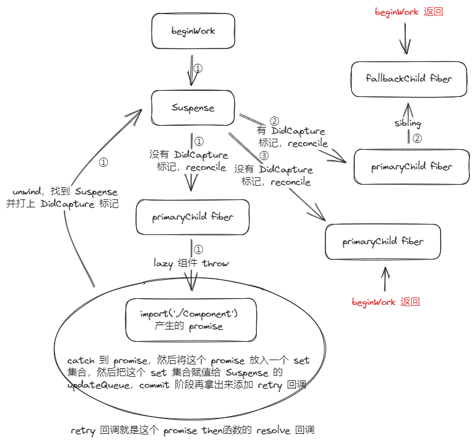

# Suspense

_>_ 注：本文使用的 `react` 版本为 `v18.2.0`，`Suspense` 有关源码在 `/packages/react-reconciler/src/ReactFiberHooks.js -> dispatchSetState` | `/packages/react-reconciler/src/ReactBeginWork.js -> updateSuspenseComponent`

`Suspense` 相信大家都不陌生，`react` [最初](https://legacy.reactjs.org/blog/2018/10/23/react-v-16-6.html)开发这一特性是为了动态加载组件和数据获取，现在比较常用的功能是**动态加载组件**，配合打包工具可以实现 `Code-Splitting` 的性能优化操作，数据获取还处于实验性中（最后会讲一下），下面给出一个常用的 `Suspense` 配合 `lazy` 实现的**动态加载组件**的例子

```jsx
// App.jsx

import {Suspense, lazy} from 'react';

const Component = lazy(async () => {
  await new Promise((resolve, reject) => {
    setTimeout(() => {
      resolve();
    }, 1000);
  });

  return import('./Component');
});

function App() {
  return (
    <div>
      <Suspense fallback={<div>Loading...</div>}>
        <Component />
      </Suspense>
    </div>
  );
}

export default App;


// Component.jsx
function Component() {
  return <div>Component</div>;
}

export default Component;
```

这段代码定义了一个需要动态加载的 `Component` 组件。会在一开始显示 `fallback` 中的内容 `loading`，1s 后显示 `Component`

说一下上面代码的执行流程（ `suspense` 是有两种类型的 `child`，一个是真正要显示的 `child`，称为 `primaryChild`，`primaryChild` 其实是一个 `OffscreenComponent`，在 [react18 的发行版本](https://react.dev/blog/2022/03/29/react-v18)中有提到，跟 `vue` 中的 `keep-alive` 类型，可以简单理解为可以不可见状态下渲染某些东西的组件，另一个是 `fallback` 里面的内容，称为 `fallbackChild`）

- 第一次 `beginWork` 到 `Suspense fiber`，`reconcile` 出来的是 `primaryChild ` 的子级 `fiber`，然后当 `beginWork` 到 `primaryChild` 的 `lazy` 组件时会把 `import('./Component')` 产生的 `promise` `throw` 出来，因为 `reconcile` 的过程会被一个 `try...catch` 包裹住，所以 `promise` 会被 `catch` 到（会在这个 `promise` 的 `then` 函数的 `resolve` 回调里面开启一次新的更新），之后会进入 `unwind` 流程， `unwind` 可以看作一个别样的 `completeWork` ，同样是往上"归"的过程，对于 `promise` ，会往上找 `Suspense fiber`，对于正常的异常，会往上找 `ErrorBoundary fiber`，当找到了 `Suspense fiber`，会把其对应的 `fiber` 打上 `DidCapture` 的标记（决定 `Suspense` 的 `child` 是 `primaryChild` 还是 `fallbackChild` ）
- 接下来会执行 `workInProgress = Suspense` ，`beginWork` 重新从 `Suspense fiber` 开始（第二次），此时是有 `DidCapture` 标记，所以 `Suspense` 会展示 `fallbackChild` ，此时 `reconcile` 出来的是 `primaryChild ` 和 `fallbackChild`的子级 `fiber`， `primaryChild ` 是直接子 `fiber`，`Suspense fiber` 的 `beginWork` 返回的是 `fallbackChild` 对应的 `fiber`
- 第三次 `beginWork` 到 `Suspense fiber` 时，此时 `reconcile` 出来的是 `primaryChild ` ，返回的是 `primaryChild ` 对应的 `fiber`，因为 `Component` 已经加载好了，`lazy` 组件不会再 `throw` `promise`，而是 `return` 正常的组件，所以最后展示的就是正常的组件



## lazy

我们先来看看 `lazy` 的类型定义

```ts
type LazyComponent<T, P> = {
  $$typeof: symbol | number,
  _payload: P,
  _init: (payload: P) => T,
};


function lazy<T>(
ctor: () => Thenable<{default: T, ...}>,
): LazyComponent<T, Payload<T>>
```

接受一个返回 `thenable` （ `promise` ）对象的函数，`thenable` `resolve` 的值是一个带有 `default` 属性值的对象

接下来看看源码

```js
function lazy(ctor) {
  const payload = {
    // 状态 - 未初始化
    _status: Uninitialized,
    // 保存构造函数
    _result: ctor,
  };
  const lazyType = {
    $$typeof: REACT_LAZY_TYPE,
    _payload: payload,
    _init: lazyInitializer,
  };

  return lazyType;
}
```

`lazyInitializer`

```js
function lazyInitializer(payload) {
  // 如果还未初始化
  if (payload._status === Uninitialized) {
    // 拿到构造函数返回的 thenable 对象
    const ctor = payload._result;
    const thenable = ctor();

    // 待到状态改变时，保存状态和相应的结果值
    thenable.then(
      (moduleObject) => {
        if (payload._status === Pending || payload._status === Uninitialized) {
          const resolved = payload;
          resolved._status = Resolved;
          resolved._result = moduleObject;
        }
      },
      (error) => {
        if (payload._status === Pending || payload._status === Uninitialized) {
          const rejected = payload;
          rejected._status = Rejected;
          rejected._result = error;
        }
      },
    );

    // 仍然没有初始化，保存 thenable 对象并等待其状态改变，暂时将其状态设置为 pending
    if (payload._status === Uninitialized) {
      const pending = payload;
      pending._status = Pending;
      pending._result = thenable;
    }
  }

  // 如果状态是 Resolved ，return moduleObject.default
  if (payload._status === Resolved) {
    const moduleObject = payload._result;
    return moduleObject.default;
  }
  // 如果状态是 Pending || Rejected ，throw payload._result
  else {
    throw payload._result;
  }
}
```

`lazy` 的定义讲完了，然后来到 `beginWork` 中，首先肯定是 `beginWork` 到 `Suspense fiber`

`updateSuspenseComponent`

```js
function updateSuspenseComponent(current, workInProgress, renderLanes) {
  const nextProps = workInProgress.pendingProps;

  // 决定是否展示 fallbackChild
  let showFallback = false;
  const didSuspend = (workInProgress.flags & DidCapture) !== NoFlags;
  // shouldRemainOnFallback 涉及到另一个知识 SuspenseList 暂时忽略
  if (didSuspend || shouldRemainOnFallback(current, workInProgress, renderLanes)) {
    // 存在挂起的 child ，准备渲染 fallbackChild
    showFallback = true;
    workInProgress.flags &= ~DidCapture;
  }

  if (current === null) {
    // 初始化挂载阶段

    // ...

    const nextPrimaryChildren = nextProps.children;
    const nextFallbackChildren = nextProps.fallback;

    if (showFallback) {
      pushFallbackTreeSuspenseHandler(workInProgress);

      const fallbackFragment = mountSuspenseFallbackChildren(
        workInProgress,
        nextPrimaryChildren,
        nextFallbackChildren,
        renderLanes,
      );
      const primaryChildFragment = workInProgress.child;
      // OffscreenState 和 Cache 有关，暂时忽略
      primaryChildFragment.memoizedState = mountSuspenseOffscreenState(renderLanes);
      // 初始化 memoizedState ， 这是一个标记，表明 Suspense 正在渲染 fallbackChild
      workInProgress.memoizedState = SUSPENDED_MARKER;

      // ...

      // 返回 fallbackChildFragment，跳过 primaryChild 的调和，这样 commit 阶段就不会渲染了
      return fallbackFragment;
    } else if (enableCPUSuspense && typeof nextProps.unstable_expectedLoadTime === 'number') {
      // ...
    } else {
      // Suspense 入栈
      pushPrimaryTreeSuspenseHandler(workInProgress);
      // 第一次 beginWork 到 Suspense fiber 走此处的逻辑，返回 primaryChild fiber，准备进入 lazy 组件的调和
      return mountSuspensePrimaryChildren(workInProgress, nextPrimaryChildren, renderLanes);
    }
  } else {
    // 更新阶段

    // ...

    if (showFallback) {
      pushFallbackTreeSuspenseHandler(workInProgress);

      const nextFallbackChildren = nextProps.fallback;
      const nextPrimaryChildren = nextProps.children;
      const fallbackChildFragment = updateSuspenseFallbackChildren(
        current,
        workInProgress,
        nextPrimaryChildren,
        nextFallbackChildren,
        renderLanes,
      );
      const primaryChildFragment = workInProgress.child;
      // primaryChildFragment.memoizedState = mountSuspenseOffscreenState(renderLanes);
      const prevOffscreenState = current.child.memoizedState;
      primaryChildFragment.memoizedState =
        prevOffscreenState === null
          ? mountSuspenseOffscreenState(renderLanes)
          : updateSuspenseOffscreenState(prevOffscreenState, renderLanes);

      primaryChildFragment.childLanes = getRemainingWorkInPrimaryTree(current, renderLanes);
      workInProgress.memoizedState = SUSPENDED_MARKER;

      // 返回 fallbackChildFragment，跳过 primaryChild 的调和，这样 commit 阶段就不会渲染了
      return fallbackChildFragment;
    } else {
      pushPrimaryTreeSuspenseHandler(workInProgress);

      const nextPrimaryChildren = nextProps.children;
      const primaryChildFragment = updateSuspensePrimaryChildren(
        current,
        workInProgress,
        nextPrimaryChildren,
        renderLanes,
      );
      workInProgress.memoizedState = null;

      // 返回 primaryChild fiber，准备进入 lazy 组件的调和
      return primaryChildFragment;
    }
  }
}
```

## Mount

首先初始化阶段，没有 `didCapture` 标记， `showFallback` 为 `false`，走 `mountSuspensePrimaryChildren` 的逻辑

`mountSuspensePrimaryChildren`

```js
function mountSuspensePrimaryChildren(workInProgress, primaryChildren, renderLanes) {
  const mode = workInProgress.mode;
  const primaryChildProps = {
    mode: 'visible',
    children: primaryChildren,
  };

  const primaryChildFragment = mountWorkInProgressOffscreenFiber(
    primaryChildProps,
    mode,
    renderLanes,
  );

  // 连接 fiber 结构
  primaryChildFragment.return = workInProgress;
  workInProgress.child = primaryChildFragment;

  return primaryChildFragment;
}
```

上面的逻辑就涉及到 `offscreenComponent` 了，此时 `OffscreenComponent` 的 `mode` 为 `visible`，可以把它看成无操作组件

当我们继续往下调和至 `lazy` 组件时，lazy 组件会 `throw` 出一个 `thenable` 对象

`mountLazyComponent`

```js
function mountLazyComponent(_current, workInProgress, elementType, renderLanes) {
  resetSuspendedCurrentOnMountInLegacyMode(_current, workInProgress);

  const props = workInProgress.pendingProps;
  const lazyComponent = elementType;
  const payload = lazyComponent._payload;
  const init = lazyComponent._init;

  // init 执行时， 如果是 thenable 的状态时 resolved 会直接返回 { default: xxx } 中 default 对应的值
  // 如果不是则会把 thenable 对象 throw 出来
  let Component = init(payload);
  // 将 unwrapped component 存储在 type 中，就是 { default: xxx } 中 default 对应的值
  workInProgress.type = Component;
}
```

`mountLazyComponent` 的作用其实就是执行 `lazyInitializer`，关键点在 `throw` `thenable` 对象，这个 `thenable` 对象会被 `catch`

```js
try {
  if (
    workInProgressSuspendedReason !== NotSuspended &&
    workInProgress !== null
  ) {
    const unitOfWork = workInProgress;
    const thrownValue = workInProgressThrownValue;

    switch (workInProgressSuspendedReason) {
      case SuspendedOnHydration: {
        // ...;
      }
      default: {
        // 继续正常的 workLoop
        workInProgressSuspendedReason = NotSuspended;
        workInProgressThrownValue = null;
        throwAndUnwindWorkLoop(unitOfWork, thrownValue);
        break;
      }
    }
  }
  workLoop();
  break;
} catch (thrownValue) {
  handleThrow(root, thrownValue);
}
```

`catch` 的处的逻辑走完之后 `workInProgressSuspendedReason` 会被赋值为 `SuspendedOnDeprecatedThrowPromise`，`if` 处的逻辑就可以进入

`handleThrow`：保存对应的异常值

```js
function handleThrow(root, thrownValue) {
  if (thrownValue === SuspenseException) {
    // ...
  } else if (thrownValue === SuspenseyCommitException) {
    // ...
  } else if (thrownValue === SelectiveHydrationException) {
    // ...
  } else {
    const isWakeable =
      thrownValue !== null &&
      typeof thrownValue === 'object' &&
      typeof thrownValue.then === 'function';

    workInProgressSuspendedReason = isWakeable
      ? SuspendedOnDeprecatedThrowPromise
      : SuspendedOnError;
  }

  // throwValue 就是 thenable 对象
  workInProgressThrownValue = thrownValue;

  // ...
}
```

`throwAndUnwindWorkLoop`：为最近的 `Suspense` 或 `ErrorBoundary` 打上 `ShuoldCaptrue` 标记，然后执行 `unwind` 流程

```js
function throwAndUnwindWorkLoop(unitOfWork, thrownValue) {
  // 这是 performUnitOfWork 的一个分支，专门用于解决抛出异常的 fiber 以返回正常 workLoop 然后渲染 fallback
  // ...

  try {
    // 查找并标记可以处理此 thrownValue 最近的 Suspense 或 ErrorBoundary
    throwException(
      workInProgressRoot,
      returnFiber,
      unitOfWork,
      thrownValue,
      workInProgressRootRenderLanes,
    );
  } catch (error) {
    workInProgress = returnFiber;
    throw error;
  }

  // unwind 流程
  if (unitOfWork.flags & Incomplete) {
    unwindUnitOfWork(unitOfWork);
  } else {
    // ...
  }
}
```

`throwException`

```js
function throwException(root, returnFiber, sourceFiber, value, rootRenderLanes) {
  // 注意此处，开启 unwind 的标记
  sourceFiber.flags |= Incomplete;

  // ...

  if (value !== null && typeof value === 'object' && typeof value.then === 'function') {
    const wakeable = value;

    // ...

    // 获取最近的 SuspenseBoundary
    const suspenseBoundary = getSuspenseHandler();
    if (suspenseBoundary !== null) {
      switch (suspenseBoundary.tag) {
        case SuspenseComponent: {
          // ...

          suspenseBoundary.flags &= ~ForceClientRender;
          // SuspenseBoundary 标记 ShouldCapture，经历 unwind 流程会再标记上 DidCapture（标记 ShouldCapture 其实是没必要的）
          // markSuspenseBoundaryShouldCapture 中有说明，如下
          // TODO: I think we can remove this, since we now use `DidCapture` in
          // the begin phase to prevent an early bailout.
          markSuspenseBoundaryShouldCapture(
            suspenseBoundary,
            returnFiber,
            sourceFiber,
            root,
            rootRenderLanes,
          );
          const isSuspenseyResource = wakeable === noopSuspenseyCommitThenable;
          if (isSuspenseyResource) {
            suspenseBoundary.flags |= ScheduleRetry;
          } else {
            // 将 throw 的 thenable 对象 放入Suspense.updateQueue 中，后续会遍历这个 queue 进行回调绑定
            const retryQueue = suspenseBoundary.updateQueue;
            if (retryQueue === null) {
              suspenseBoundary.updateQueue = new Set([wakeable]);
            } else {
              retryQueue.add(wakeable);
            }
          }
          break;
        }
        case OffscreenComponent: {
          // ...
        }
        default: {
          // ...
        }
      }

      if (suspenseBoundary.mode & ConcurrentMode) {
        // 和 use hook 相关的，暂时忽略
        attachPingListener(root, wakeable, rootRenderLanes);
      }
      return;
    } else {
      if (root.tag === ConcurrentRoot) {
        // 和 use hook 相关的，暂时忽略
        attachPingListener(root, wakeable, rootRenderLanes);
        renderDidSuspendDelayIfPossible();
        return;
      } else {
        // ...
      }
    }
  } else {
    // 正常的 error，不是 thenable 对象
    // 这里的逻辑的实现似乎在最后
  }

  // 正常的 error，不是 thenable 对象
  // 寻找 ErrorBoundary 的逻辑 ...
}
```

首先判断 `value` 是否是 `thenable` 对象，是则寻找最近的 `Suspense` 边界标记 `ShouldCapture`，不是则按照正常错误的逻辑处理即寻找错误边界；这里有一个要注意的点是即使没有父级 `Suspense` 的，`lazy` 组件也能正常渲染，只不过是没有了 `fallback` 效果

ok，让我们回到 `throwAndUnwindWorkLoop` 的 `unwindUnitOfWork`，其实就是往父级 `fiber` 遍历找到有 `ShouldCapture` 标记的 `Suspense` ，将其打上 `DidCapture` 标记，然后 `workProgress` 赋值为找到的 `Suspense` 组件，然后开启第二次 `beginWork` `Suspense` 的流程，此时存在 `DidCapture` 标记 `shouldFallback` 为 `true`，走 `mountSuspenseFallbackChildren` 逻辑，此时 `OffscreenComponent` 的 `mode` 为 `hidden`

```js
function mountSuspenseFallbackChildren(
  workInProgress,
  primaryChildren,
  fallbackChildren,
  renderLanes,
) {
  const mode = workInProgress.mode;
  const progressedPrimaryFragment = workInProgress.child;

  const primaryChildProps = {
    mode: 'hidden',
    children: primaryChildren,
  };

  let primaryChildFragment;
  let fallbackChildFragment;
  if ((mode & ConcurrentMode) === NoMode && progressedPrimaryFragment !== null) {
    // ...
  } else {
    primaryChildFragment = mountWorkInProgressOffscreenFiber(primaryChildProps, mode, NoLanes);
    // fallback 包裹在 Fragment 中更容易处理 ?
    fallbackChildFragment = createFiberFromFragment(fallbackChildren, mode, renderLanes, null);
  }

  // Suspense
  //    ↓
  // primaryChildFragment → fallbackChildFragment
  primaryChildFragment.return = workInProgress;
  fallbackChildFragment.return = workInProgress;
  primaryChildFragment.sibling = fallbackChildFragment;
  workInProgress.child = primaryChildFragment;

  // 返回 fallbackChildFragment，跳过 primaryChild 的调和，这样 commit 阶段就不会渲染了
  return fallbackChildFragment;
}
```

前面有说过 `// 将 throw 的 thenable 对象 放入Suspense.updateQueue 中，后续会遍历这个 queue 进行回调绑定`，这个操作发生在 `commit` 的 `Mutation` 阶段

```js
if (flags & Update) {
  // thenable 对象的 set 集合
  const retryQueue = finishedWork.updateQueue;

  if (retryQueue !== null) {
    finishedWork.updateQueue = null;
    attachSuspenseRetryListeners(finishedWork, retryQueue);
  }
}
```

简单来说就是遍历 `updateQueue` ，往 `then` 的里面加入`retry` 回调，`retry` 回调就是用来开启新一轮 `renderLane` 为 `retryLane` 的更新

## update

当 `thenable` 对象的状态变为 `resolved`，开启新的更新，此时第三次进入`beginWork` `Suspense` 的流程，此时不存在 `DidCapture` 标记 `shouldFallback` 为 `false`，走 `updateSuspensePrimaryChildren` 逻辑，此时 `OffscreenComponent` 的 `mode` 为 `visible`

```js
function updateSuspensePrimaryChildren(current, workInProgress, primaryChildren, renderLanes) {
  const currentPrimaryChildFragment = current.child;
  const currentFallbackChildFragment = currentPrimaryChildFragment.sibling;

  const primaryChildFragment = updateWorkInProgressOffscreenFiber(currentPrimaryChildFragment, {
    mode: 'visible',
    children: primaryChildren,
  });

  primaryChildFragment.return = workInProgress;
  primaryChildFragment.sibling = null;
  if (currentFallbackChildFragment !== null) {
    // 删除 fallbackChild
    const deletions = workInProgress.deletions;
    if (deletions === null) {
      workInProgress.deletions = [currentFallbackChildFragment];
      workInProgress.flags |= ChildDeletion;
    } else {
      deletions.push(currentFallbackChildFragment);
    }
  }

  workInProgress.child = primaryChildFragment;

  // 返回 primaryChild fiber，准备进入 lazy 组件的调和
  return primaryChildFragment;
}
```

上面主要的逻辑就在于将 `fallbackChild` 装入 `deletions` 并标记 `ChildDeletion`，`commit` 阶段实现 `fallbackChild` 到 `primaryChild` 的 切换

这里还有一种情况要考虑，如果在组件动态加载的过程中，`Suspense` 上又发生了一次更新，这时候是怎么保持 `fallbackChild` 不被删除的呢，我们来分析一下，一开始的逻辑还是跟上面一样走到 `updateSuspensePrimaryChildren`，此时 `return` 了 `primaryChild fiber`，然后进入 `primaryChild fiber` 的调和，当调和到 `lazy` 组件时，依旧会 `throw` `thenable` 对象出来，逻辑照旧 `handleThrow → throwAndUnwindWorkLoop → throwException → unwindUnitOfWork`，在 `unwindUnitOfWork` 就会置空 `deletions`，这时候 `fallbackChild` 就不会被删除了，之后回到 `Suspense` 的 `beginWork`，此时不存在 `DidCapture` 标记 `shouldFallback` 为 `false`，走 `updateSuspenseFallbackChildren` 逻辑，此时 `OffscreenComponent` 的 `mode` 为 `hidden`,

```js
function unwindUnitOfWork(unitOfWork) {
  // 前面已经说过 unwindUnitOfWork 的作用
  let incompleteWork = unitOfWork;

  do {
    const current = incompleteWork.alternate;
    const next = unwindWork(current, incompleteWork, renderLanes);

    // ...

    if (next !== null) {
      next.flags &= HostEffectMask;
      workInProgress = next;
      return;
    }

    const returnFiber = incompleteWork.return;
    // 再往上遍历的过程中置空 deletions
    if (returnFiber !== null) {
      returnFiber.flags |= Incomplete;
      returnFiber.subtreeFlags = NoFlags;
      returnFiber.deletions = null;
    }

    // ...
  } while (incompleteWork !== null);

  // ...
}
```

## 数据获取

最后再演示一下数据获取

```jsx
function delay(timeout) {
  return new Promise((resolve, reject) => {
    setTimeout(() => {
      resolve();
    }, timeout);
  });
}

function fetcher() {
  return delay(1000).then(() => 'data fetched');
}

const wrapPromise = promise => {
  let status = 'pending';
  let result;
  let suspend = promise().then(
    res => {
      status = 'success';
      result = res;
    },
    err => {
      status = 'error';
      result = err;
    }
  );
  return {
    read() {
      if (status === 'pending') {
        throw suspend;
      } else if (status === 'error') {
        throw result;
      } else if (status === 'success') {
        return result;
      }
    },
  };
};

const resource = wrapPromise(fetcher);

function Child() {
  return resource.read();
}

function App() {
  return (
    <Suspense fallback={<div>Loading...</div>}>
      <Child />
    </Suspense>
  );
}

export default App;
```

参考资料

- [Suspense 源码](https://github.com/facebook/react/blob/main/packages/react-reconciler/src/ReactFiberBeginWork.js)

- [How Suspense works internally in Concurrent Mode 1 - Reconciling flow](https://juejin.cn/post/6923835053029982221)
