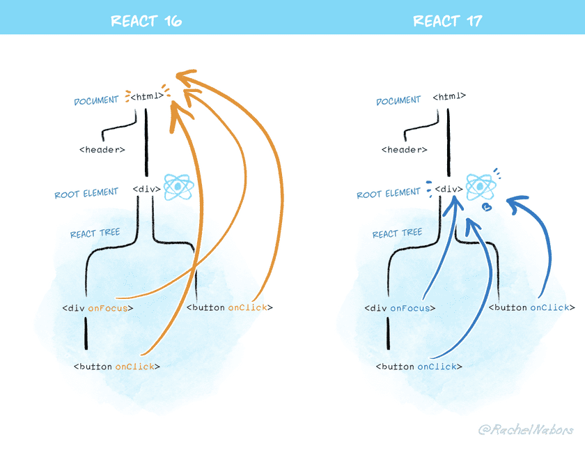
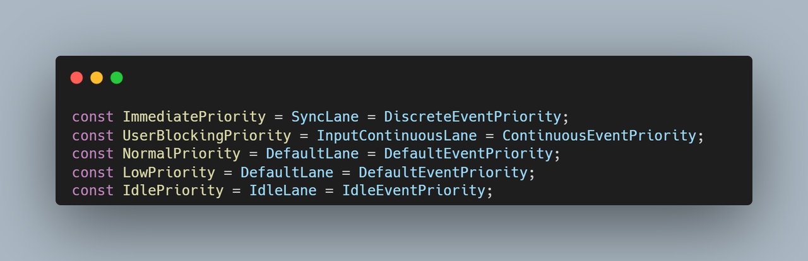
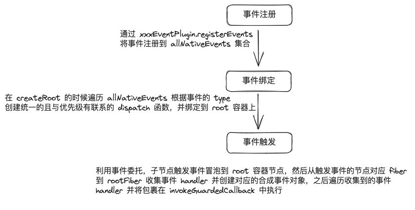

# Synthetic Event

> 注：本文使用的`react`版本为`v18.2.0`，合成事件所在的文件路径：`/packages/react-dom-bindings`

`Synthetic Event` 是合成事件的意思，代表了 `react` 事件是由一个或多个原生事件合成的，比如 `onChange` 事件是由以下原生事件合成的，

> 文件路径：packages\react-dom-bindings\src\events\plugins\ChangeEventPlugin.js

```js
function registerEvents() {
  registerTwoPhaseEvent('onChange', [
    'change',
    'click',
    'focusin',
    'focusout',
    'input',
    'keydown',
    'keyup',
    'selectionchange',
  ]);
}
```

往 `react` 深处学习我们会知道 `react` 内部是有着自己的一套事件机制的，那么问题来了，`react` 为什么要做一层封装而不直接用原生的事件呢？主要原因是为了兼容各种浏览器和跨平台（`react-native`、`electron` 等），市面上各种浏览器提供的事件 `API` 不尽相同，比如为了实现兼容所有浏览器（主要是 `IE`）的事件绑定、取消冒泡和默认事件，我们可能需要这么两个辅助函数才能达到目的：

```javascript
function addEvent(evnt, elem, func) {
  if (elem.addEventListener)
    // W3
    elem.addEventListener(evnt, func, false);
  else if (elem.attachEvent) {
    // Internet Explorer
    elem.attachEvent('on' + evnt, func);
  } else {
    // other browsers
    elem['on' + evnt] = func;
  }
}

function cancelEvent(event) {
  if (event.preventDefault) {
    event.preventDefault(); // W3
  } else {
    event.returnValue = false; // Internet Explorer
  }

  if (event.stopPropagation) {
    event.stopPropagation(); // W3
  } else {
    event.cancelBubble = true; // Internet Explorer
  }
}
```

但在 `react` 我们只需要这么使用，就可以在各种浏览器中实现相同的效果

```jsx
function Button() {
  const handleClick = (event) => {
    event.preventDefault();
    event.stopPropagation();

    console.log('按钮被点击了！！！');
  };

  return <button onClick={handleClick}></button>;
}
```

随之也带来了几个比较重要的特性

- 统一在根容器注册事件，利用事件委派，子元素上触发的事件会冒泡到组件元素上，然后在根容器上统一的触发一个 `dispatch` 事件，过程会构造合成事件，从触发事件元素对应的 `fiber` 往上遍历收集事件，然后如果是捕获阶段（注册事件的时候会传入一个 `flag` 来判断是是否是捕获阶段）触发的事件，就反向遍历执行，冒泡阶段则反之，优点很明显，事件委派减少绑定事件的数量，提高性能。

- 我们都知道 `react` 存在优先级的概念，原因是 `js` 是单线程的，如果有一个任务长期占用线程，浏览器就会被卡死，使得用户体验很差，设想这么一个场景，页面上有一个输入框，你想要在看到它之后马上输入点什么，但恰好 `useEffect` 里面执行了一个比较耗时的更新任务，你不得不等待任务完成后再去输入，这时候你的体验肯定非常糟糕 😥，所以为了快速响应用户，让用户觉得够快，`react` 引入了优先级，而且用户交互事件产生的更新任务肯定是处于高优先级，这样才能打断低优先级的更新任务，所以事件又是与优先级紧密联系的，`react` 对原生事件做封装能更加方便地对事件进行归类并区分优先级。

### 事件注册

事件注册是马上执行的，也就是一旦加载了 `react` 就会执行

```js
// 区分不同事件的注册逻辑

// 注册顶级事件（捕获和冒泡）
SimpleEventPlugin.registerEvents();
// 注册 onMouseEnter、onMouseLeave 相关事件（冒泡）
EnterLeaveEventPlugin.registerEvents();
// 注册 onChange 相关事件（捕获和冒泡）
ChangeEventPlugin.registerEvents();
// 注册 onSelect 相关事件（捕获和冒泡）
SelectEventPlugin.registerEvents();
// 注册 onBeforeInput，onCompositionUpdate 相关事件（捕获和冒泡）
BeforeInputEventPlugin.registerEvents();
```

以上都是注册事件，都会调用 `registerTwoPhaseEvent` 将事件添加到 `allNativeEvents set` 集合中

1. registerSimpleEvents：

   ```js
   function registerSimpleEvents() {
     for (let i = 0; i < simpleEventPluginEvents.length; i++) {
       // E.g. click -> onClick 的转换
       const eventName = simpleEventPluginEvents[i];
       const domEventName = eventName.toLowerCase();
       const capitalizedEvent = eventName[0].toUpperCase() + eventName.slice(1);

       registerSimpleEvent(domEventName, 'on' + capitalizedEvent);
     }
   }
   ```

2. `registerSimpleEvent`：

   ```js
   function registerSimpleEvent(domEventName, reactName) {
     // E.g. click -> onClick 的映射
     // 事件触发的时候根据 click 取 onClick
     topLevelEventsToReactNames.set(domEventName, reactName);
     // 注册捕获和冒泡阶段的事件
     registerTwoPhaseEvent(reactName, [domEventName]);
   }
   ```

3. `registerDirectEvent`：

   ```js
   function registerDirectEvent(registrationName, dependencies) {
     // react17前
     // registrationNameDependencies 是一个对象，存储了所有 React 事件对应的原生 DOM 事件的集合
     // 这是识别 prop 是否为事件的依据。如果是事件类型的 prop，那么将会调用 ensureListeningTo（completeWork阶段）去绑定事件
     // react17后
     // registrationNameDependencies 就基本没什么作用了
     registrationNameDependencies[registrationName] = dependencies;

     for (let i = 0; i < dependencies.length; i++) {
       allNativeEvents.add(dependencies[i]);
     }
   }
   ```

### 事件绑定

事件绑定 `17` 和 `16` 有两个不同点

- `react17` 之前事件绑定的时机是在调和的 `completeWork`（与 `beginWork` 相对的“归”）阶段，`17` 后改在 `createRoot` 里面了，也就是说根容器创建完就开始绑定事件（[对应的 PR](https://github.com/facebook/react/issues/19659)）

  - 减少了错误处理的复杂性：在 `completeWork` 阶段进行事件绑定可能导致错误，而这些错误需要在调和过程中进行处理。将事件绑定移到 `createRoot` 可以简化错误处理逻辑，提高代码的可维护性。

  - 提高性能：将事件绑定移到渲染任务之前，可以确保浏览器在执行渲染任务时不会被事件绑定操作阻塞。这有助于提高应用的响应速度和性能。

- `react17` 之前事件是统一绑定在 `document` 元素上的，`17` 之后改成了绑定在根容器上（因为绑定在 `document` 上已经报告了[很](https://github.com/facebook/react/issues/4335) [多](https://github.com/facebook/react/pull/8117) [问](https://github.com/facebook/react/issues/285#issuecomment-253502585) [题](https://github.com/facebook/react/issues/13451)），下面引用 `react` 官网的一张图来体现变化：

  

  顺便说一句，这个想法 `react` 似乎早就已经提出[（相关 issue）](https://github.com/facebook/react/issues/2043)

  下面举个简单地例子来说明一下原因：

  ```html
  <div id="outer">
    <div id="inner"></div>
  </div>
  ```

  ```jsx
  function App() {
      const handleClick = () => {
          console.log('click');
      }

      return <button onClick={handleClick}></button>;
  }

  // react18之前的 render 方式，现在可以使用
  // ReactDOM.createRoot(document.getElementById('root')).render(<App />);
  ReactDOM.render(<App />, document.getElementbyId('inner'));

  document.getElementbyId('outer').addEventListener('click', (e) = > {
      e.stopPropagation();
  });
  ```

  由于 `17` 之前的事件是绑定在 `document` 元素上的，所以 `react` 事件触发的必要条件是冒泡到 `document` 元素，但是上面例子中 `react` 容器父级的 `div` 绑定了相同的 `click` 事件并且取消了冒泡，这就会导致 `react` 应用内部的事件全部失效。

  > 拓展：上面的 react 事件失效还有可能引起 react 在微前端中的应用，比如使用[micro-app](https://cangdu.org/micro-app/docs.html)，因为 micro-app 是基于 WebComponent 实现的，应用会被挂在 WebComponent 内部。

1. `listenToAllSupportedEvents`：从名字很明显可以看出意思，监听所有支持的事件，在 `createRoot` 中调用

   ```js
   function listenToAllSupportedEvents(rootContainerElement) {
     allNativeEvents.forEach((domEventName) => {
       // 注册支持冒泡的事件
       if (!nonDelegatedEvents.has(domEventName)) {
         listenToNativeEvent(domEventName, false, rootContainerElement);
       }
       listenToNativeEvent(domEventName, true, rootContainerElement);
     });
   }
   ```

2. `listenToNativeEvent`：这个函数很简单，就是根据 `isCapturePhaseListener` 判断是不是捕获阶段，关键在 `addTrappedEventListener`

   ```js
   function listenToNativeEvent(domEventName, isCapturePhaseListener, target) {
     // 事件类型标识
     let eventSystemFlags = 0;
     // 判断是否是捕获阶段的flag，后面很多函数都会用到
     if (isCapturePhaseListener) {
       eventSystemFlags |= IS_CAPTURE_PHASE;
     }

     addTrappedEventListener(target, domEventName, eventSystemFlags, isCapturePhaseListener);
   }
   ```

3. `addTrappedEventListener`：这里面的关键是调用了 `createEventListenerWrapperWithPriority`、`addEventCaptureListener` 和 `addEventCaptureListener`

   ```js
   function addTrappedEventListener(
     targetContainer,
     domEventName,
     eventSystemFlags,
     isCapturePhaseListener,
     isDeferredListenerForLegacyFBSupport,
   ) {
     let listener = createEventListenerWrapperWithPriority(
       targetContainer,
       domEventName,
       eventSystemFlags,
     );
     // If passive option is not supported, then the event will be
     // active and not passive.
     let isPassiveListener = undefined;
     if (passiveBrowserEventsSupported) {
       // 这是一个有趣的 issue，感兴趣可以看看
       // 浏览器引入了一种干预，默认情况下使这些事件在 document 上是 passive 的
       // React 不再将事件绑定到 document，但现在更改此设置会抵消更改带来的性能提升
       // 所以我们现在在根容器上手动模拟现有行为
       // https://github.com/facebook/react/issues/19651
       if (
         domEventName === 'touchstart' ||
         domEventName === 'touchmove' ||
         domEventName === 'wheel'
       ) {
         isPassiveListener = true;
       }
     }

     targetContainer =
       enableLegacyFBSupport && isDeferredListenerForLegacyFBSupport
         ? targetContainer.ownerDocument
         : targetContainer;
     // 不太理解这个是干什么的，事件难道可以这样解绑吗（unsubscribeListener()）？
     let unsubscribeListener;
     // 捕获
     if (isCapturePhaseListener) {
       if (isPassiveListener !== undefined) {
         // addEventListener 的第三个参数多传了一个 passive
         unsubscribeListener = addEventCaptureListenerWithPassiveFlag(
           targetContainer,
           domEventName,
           listener,
           isPassiveListener,
         );
       } else {
         unsubscribeListener = addEventCaptureListener(targetContainer, domEventName, listener);
       }
     }
     // 冒泡
     else {
       if (isPassiveListener !== undefined) {
         // addEventListener 的第三个参数多传了一个 passive
         unsubscribeListener = addEventBubbleListenerWithPassiveFlag(
           targetContainer,
           domEventName,
           listener,
           isPassiveListener,
         );
       } else {
         unsubscribeListener = addEventBubbleListener(targetContainer, domEventName, listener);
       }
     }
   }
   ```

4. `createEventListenerWrapperWithPriority`：将事件和优先级联系起来

   下面是 `lane`、`schedulePriority` 和 `eventPriority` 的对应关系图

   

   ```js
   function createEventListenerWrapperWithPriority(
     targetContainer,
     domEventName,
     eventSystemFlags,
   ) {
     // 根据事件分配不同的优先级
     const eventPriority = getEventPriority(domEventName);
     let listenerWrapper;
     // 根据优先级分配不同的 dispatch 函数
     switch (eventPriority) {
       case DiscreteEventPriority:
         listenerWrapper = dispatchDiscreteEvent;
         break;
       case ContinuousEventPriority:
         listenerWrapper = dispatchContinuousEvent;
         break;
       case DefaultEventPriority:
       default:
         listenerWrapper = dispatchEvent;
         break;
     }
     return listenerWrapper.bind(null, domEventName, eventSystemFlags, targetContainer);
   }
   ```

### 事件触发（这里拿 click 事件举例）

1. `dispatchDiscreteEvent`：设置当前事件优先级，然后执行 `dispatch` 函数，执行完后还原优先级（设置优先级是为了如果调用了 `setXxx`，就能产生一个相应 `lane` 的 `Update` 对象）

   ```js
   function dispatchDiscreteEvent(domEventName, eventSystemFlags, container, nativeEvent) {
     const previousPriority = getCurrentUpdatePriority();
     try {
       setCurrentUpdatePriority(DiscreteEventPriority);
       dispatchEvent(domEventName, eventSystemFlags, container, nativeEvent);
     } finally {
       setCurrentUpdatePriority(previousPriority);
     }
   }
   ```

2. `dispatchEvent`：

   ```js
   function dispatchEvent(domEventName, eventSystemFlags, targetContainer, nativeEvent) {
     // ...
     dispatchEventForPluginEventSystem(
       domEventName,
       eventSystemFlags,
       nativeEvent,
       return_targetInst,
       targetContainer,
     );
     // ...
   }
   ```

3. `dispatchEventForPluginEventSystem`：这个函数从名字我们就能猜出它的作用，将事件分派给插件去做，关键部分在最后面的 `dispatchEventsForPlugins`，前面部分的话注释已经写的比较清楚了，事件会被绑定到每个 `React Root` 和 `React Portal Root`，这些根的 `DOM` 节点一起就是 `rootContainer`，为了找出我们应该使用哪个祖先实例，我们从目标实例向上遍历 `fiber` 树，并尝试找到与我们当前的 `rootContainer` 相匹配的根边界。如果我们找到`rootContainer`，我们就会找到该根的父 `fiber` 子树，并将其作为我们的祖先实例。

   ```js
   function dispatchEventForPluginEventSystem(
     domEventName,
     eventSystemFlags,
     nativeEvent,
     targetInst,
     targetContainer,
   ) {
     let ancestorInst = targetInst;
     if (
       (eventSystemFlags & IS_EVENT_HANDLE_NON_MANAGED_NODE) === 0 &&
       (eventSystemFlags & IS_NON_DELEGATED) === 0
     ) {
       const targetContainerNode = targetContainer;

       if (targetInst !== null) {
         let node = targetInst;

         mainLoop: while (true) {
           if (node === null) {
             return;
           }
           const nodeTag = node.tag;
           if (nodeTag === HostRoot || nodeTag === HostPortal) {
             let container = node.stateNode.containerInfo;
             if (isMatchingRootContainer(container, targetContainerNode)) {
               break;
             }
             if (nodeTag === HostPortal) {
               // 目标是一个 Portal，但它不是我们正在寻找的 rootContainer。通常，
               // Portal 会一直处理它们自己的事件，直至根目录。所以我们现在应该可以停下来了。
               // 但是，我们不知道此门户是否是 *我们的* 根目录的一部分。
               let grandNode = node.return;
               while (grandNode !== null) {
                 const grandTag = grandNode.tag;
                 if (grandTag === HostRoot || grandTag === HostPortal) {
                   const grandContainer = grandNode.stateNode.containerInfo;
                   if (isMatchingRootContainer(grandContainer, targetContainerNode)) {
                     // 这是我们正在寻找的 rootContainer，我们发现它是 Portal 的父级。
                     // 这意味着我们可以忽略它，因为 Portal 会向我们冒泡。
                     return;
                   }
                 }
                 grandNode = grandNode.return;
               }
             }
             // 现在我们需要在另一棵树中找到它对应的 host fiber。为此，
             // 我们可以使用 getClosestInstanceFromNode，但我们需要验证 fiber
             // 是一个 host instance，否则我们需要向上遍历 DOM，
             // 直到找到来自另一棵树的正确节点。
             while (container !== null) {
               const parentNode = getClosestInstanceFromNode(container);
               if (parentNode === null) {
                 return;
               }
               const parentTag = parentNode.tag;
               if (
                 parentTag === HostComponent ||
                 parentTag === HostText ||
                 (enableFloat ? parentTag === HostHoistable : false) ||
                 (enableHostSingletons ? parentTag === HostSingleton : false)
               ) {
                 node = ancestorInst = parentNode;
                 continue mainLoop;
               }
               container = container.parentNode;
             }
           }
           node = node.return;
         }
       }
     }

     batchedUpdates(() =>
       dispatchEventsForPlugins(
         domEventName,
         eventSystemFlags,
         nativeEvent,
         ancestorInst,
         targetContainer,
       ),
     );
   }
   ```

4. `dispatchEventsForPlugins`：

   ```js
   function dispatchEventsForPlugins(
     domEventName,
     eventSystemFlags,
     nativeEvent,
     targetInst,
     targetContainer,
   ) {
     // 获取触发事件的目标对象
     const nativeEventTarget = getEventTarget(nativeEvent);
     const dispatchQueue = [];
     // 从触发事件的 fiber 对象往上收集对应的事件函数，存在 dispatchQueue 中
     extractEvents(
       dispatchQueue,
       domEventName,
       targetInst,
       nativeEvent,
       nativeEventTarget,
       eventSystemFlags,
       targetContainer,
     );
     // 统一处理收集到的事件函数
     processDispatchQueue(dispatchQueue, eventSystemFlags);
   }
   ```

5. `extractEvents`：从原生事件（`nativeEvent`）中提取相关的事件，里面提供了多个事件插件，目的是给不同的事件提供不同的处理逻辑

   ```js
   function extractEvents(
     dispatchQueue: DispatchQueue,
     domEventName: DOMEventName,
     targetInst: null | Fiber,
     nativeEvent: AnyNativeEvent,
     nativeEventTarget: null | EventTarget,
     eventSystemFlags: EventSystemFlags,
     targetContainer: EventTarget,
   ) {
     // 事件系统的基本功能
     // 调用 SimpleEventPlugin.extractEvents 来处理基本的事件系统功能，
     // 如冒泡和捕获事件
     SimpleEventPlugin.extractEvents(
       dispatchQueue,
       domEventName,
       targetInst,
       nativeEvent,
       nativeEventTarget,
       eventSystemFlags,
       targetContainer,
     );
     const shouldProcessPolyfillPlugins =
       (eventSystemFlags & SHOULD_NOT_PROCESS_POLYFILL_EVENT_PLUGINS) === 0;
     // EnterLeaveEventPlugin、ChangeEventPlugin、SelectEventPlugin
     // 和 BeforeInputEventPlugin。这些插件提供了一些特定的事件处理逻辑
     if (shouldProcessPolyfillPlugins) {
       EnterLeaveEventPlugin.extractEvents(
         dispatchQueue,
         domEventName,
         targetInst,
         nativeEvent,
         nativeEventTarget,
         eventSystemFlags,
         targetContainer,
       );
       ChangeEventPlugin.extractEvents(
         dispatchQueue,
         domEventName,
         targetInst,
         nativeEvent,
         nativeEventTarget,
         eventSystemFlags,
         targetContainer,
       );
       SelectEventPlugin.extractEvents(
         dispatchQueue,
         domEventName,
         targetInst,
         nativeEvent,
         nativeEventTarget,
         eventSystemFlags,
         targetContainer,
       );
       BeforeInputEventPlugin.extractEvents(
         dispatchQueue,
         domEventName,
         targetInst,
         nativeEvent,
         nativeEventTarget,
         eventSystemFlags,
         targetContainer,
       );
       if (enableFormActions) {
         FormActionEventPlugin.extractEvents(
           dispatchQueue,
           domEventName,
           targetInst,
           nativeEvent,
           nativeEventTarget,
           eventSystemFlags,
           targetContainer,
         );
       }
     }
   }
   ```

   `SimpleEventPlugin.extractEvents`

   ```js
   function extractEvents(
     dispatchQueue,
     domEventName,
     targetInst,
     nativeEvent,
     nativeEventTarget,
     eventSystemFlags,
     targetContainer,
   ) {
     // click -> onClick
     const reactName = topLevelEventsToReactNames.get(domEventName);
     if (reactName === ndefined) {
       return;
     }
     // 合成事件构造函数
     let SyntheticEventCtor = SyntheticEvent;
     let reactEventType = domEventName;

     const inCapturePhase = (eventSystemFlags & IS_CAPTURE_PHASE) !== 0;
     const listeners = accumulateSinglePhaseListeners(
       targetInst,
       reactName,
       nativeEvent.type,
       inCapturePhase,
       accumulateTargetOnly,
       nativeEvent,
     );
     if (listeners.length > 0) {
       const event = new SyntheticEventCtor(
         reactName,
         reactEventType,
         null,
         nativeEvent,
         nativeEventTarget,
       );
       dispatchQueue.push({ event, listeners });
     }
   }
   ```

6. `accumulateSinglePhaseListeners`：积累单个阶段的事件监听器（冒泡、捕获），里面的逻辑其实就是从目标 `fiber` 开始到 `rootFiber` 收集对应的 `reactEvent`

   ```js
   function accumulateSinglePhaseListeners(
     targetFiber,
     reactName,
     nativeEventType,
     inCapturePhase,
     accumulateTargetOnly,
     nativeEvent,
   ) {
     const captureName = reactName !== null ? reactName + 'Capture' : null;
     const reactEventName = inCapturePhase ? captureName : reactName;
     let listeners = [];

     let instance = targetFiber;
     let lastHostComponent = null;

     // 从目标 fiber 到 rootFiber 收集对应的事件函数
     while (instance !== null) {
       const { stateNode, tag } = instance;
       // 处理 HostComponents 上的监听器 (例如 <div>)
       if (
         (tag === HostComponent ||
           (enableFloat ? tag === HostHoistable : false) ||
           (enableHostSingletons ? tag === HostSingleton : false)) &&
         stateNode !== null
       ) {
         lastHostComponent = stateNode;

         if (reactEventName !== null) {
           const listener = getListener(instance, reactEventName);
           if (listener != null) {
             listeners.push(createDispatchListener(instance, listener, lastHostComponent));
           }
         }
       } else if (
         enableCreateEventHandleAPI &&
         enableScopeAPI &&
         tag === ScopeComponent &&
         lastHostComponent !== null &&
         stateNode !== null
       ) {
         // Scopes
         // ...
       }
       // 如果只是为目标累积事件，那么就不会继续通过 React fiber 树传播来寻找其他侦听器
       if (accumulateTargetOnly) {
         break;
       }
       // ...
       instance = instance.return;
     }
     return listeners;
   }
   ```

7. `processDispatchQueue`：

   ```js
   function processDispatchQueue(dispatchQueue, eventSystemFlags) {
     const inCapturePhase = (eventSystemFlags & IS_CAPTURE_PHASE) !== 0;
     for (let i = 0; i < dispatchQueue.length; i++) {
       const { event, listeners } = dispatchQueue[i];
       processDispatchQueueItemsInOrder(event, listeners, inCapturePhase);
       //  event system doesn't use pooling.
     }
     // 如果有任何事件处理函数抛出 error，这将是重新抛出的好时机，后面会再提到
     // 作用是在受保护的函数的执行过程中，捕获第一个错误，保存在 rethrowError 这个全局变量中，
     // 并将其重新抛出，交由顶级 error 事件处理
     rethrowCaughtError();
   }
   ```

8. `processDispatchQueueItemsInOrder`：其实就是把 `extractEvents` 从目标 `fiber` 收集到 `rootFiber` 的事件函数，模拟捕获（从后往前）冒泡（从前往后）阶段执行一遍

   ```js
   function processDispatchQueueItemsInOrder(event, dispatchListeners, inCapturePhase) {
     let previousInstance;
     if (inCapturePhase) {
       // 捕获阶段下从后往前执行
       for (let i = dispatchListeners.length - 1; i >= 0; i--) {
         const { instance, currentTarget, listener } = dispatchListeners[i];
         // 调用了 event.stopPropagation 则 event.isPropagationStopped() 返回 true
         // 代表取消了冒泡，事件就不能继续执行
         if (instance !== previousInstance && event.isPropagationStopped()) {
           return;
         }
         executeDispatch(event, listener, currentTarget);
         previousInstance = instance;
       }
     } else {
       // 冒泡阶段下从前往后执行
       for (let i = 0; i < dispatchListeners.length; i++) {
         const { instance, currentTarget, listener } = dispatchListeners[i];
         if (instance !== previousInstance && event.isPropagationStopped()) {
           return;
         }
         executeDispatch(event, listener, currentTarget);
         previousInstance = instance;
       }
     }
   }
   ```

9. `executeDispatch`：这个函数没什么好讲的，关键在 `invokeGuardedCallbackAndCatchFirstError`

   ```js
   function executeDispatch(event, listener, currentTarget) {
     const type = event.type || 'unknown-event';
     event.currentTarget = currentTarget;
     invokeGuardedCallbackAndCatchFirstError(type, listener, undefined, event);
     event.currentTarget = null;
   }
   ```

10. `invokeGuardedCallbackAndCatchFirstError`：从名字我们也可以猜出大致的意思，

    调用受保护的回调函数并捕获第一个错误，`invokeGuardedCallback`执行过程中如果出错，则先 catch 住保存下来，放到 `rethrowCaughtError` 再抛出

    ```js
    function invokeGuardedCallbackAndCatchFirstError(name, func, context, a, b, c, d, e, f) {
      invokeGuardedCallback.apply(this, arguments);

      if (hasError) {
        const error = clearCaughtError();
        if (!hasRethrowError) {
          hasRethrowError = true;
          rethrowError = error;
        }
      }
    }
    ```

11. `invokeGuardedCallback`：

    ```js
    function invokeGuardedCallback(name, func, context, a, b, c, d, e, f) {
      // 重置 error
      hasError = false;
      caughtError = null;
      // reporter 是保存错误的方法
      // const reporter = {
      //   onError(error) {
      //     hasError = true;
      //     caughtError = error;
      //   },
      // };
      invokeGuardedCallbackImpl.apply(reporter, arguments);
    }
    ```

12. `invokeGuardedCallbackImpl`：分两个环境，在开发环境下利用全局的 `error` 事件和自定义事件模拟了 `try ... catch` ，[从而保持浏览器正常的 `Pause on exceptions` 行为](https://github.com/facebook/react/issues/4982)；生产环境则是真正使用了 `try ... catch` 。总的来说，`invokeGuardedCallbackImpl` 是 `React` 内部用于执行回调函数并提供错误边界保护的函数。它在开发模式下会使用一些特殊的技巧来避免吞没用户业务代码的异常，以提供更好的调试体验，而在生产模式下则会简单地使用 `try ... catch` 语句来捕获错误。

    举个例子：

    ```js
    window.onerror = (e) => {
      console.log('捕获全局异常...', e);
    };

    console.log(a);
    ```

    当开启 `Pause on exceptions` 时，断点是会停在 `console.log(a);` 这一行的

    但是如果是下面这样

    ```js
    try {
      console.log(a);
    } catch (e) {
      console.log('捕获异常...', e);
    }
    ```

    当开启 `Pause on exceptions` 时，断点是不会停在 `console.log(a);` 这一行的

    当然也可以通过开启 `Pause On Caught Exceptions` ，让断点停在 `console.log('捕获异常...', e);` 这一行

    这里正好对应了 `react` 开发和生产两种模式下的做法（其他 `react` 中的有关错误捕获的地方也是用到了同样的机制）

    ```js
    function invokeGuardedCallbackImpl(name, func, context) {
      if (__DEV__) {
        // fakeNode 表示我们处于一个包含 document 和 window 对象的环境中
        if (fakeNode) {
          const evt = document.createEvent('Event');

          let didCall = false;
          // 跟踪用户提供的 handler 是否引发错误。一开始将其设置为 true，
          // 然后在调用该函数后立即将其设置为 false。如果函数出错，
          // `didError` 永远为 true。
          // 即使浏览器不稳定并且无法调用我们的全局 error 事件，
          // 此策略也能正常工作，因为它根本不依赖于 error 事件。
          let didError = true;

          // 跟踪 window.event 的值，以便我们可以在 callback 执行期间重置它，
          // 让用户代码在支持它的浏览器中访问 window.event。
          const windowEvent = window.event;

          // 跟踪 window.event 的描述符以在事件发生后恢复它
          // dispatching: https://github.com/facebook/react/issues/13688
          const windowEventDescriptor = Object.getOwnPropertyDescriptor(window, 'event');

          const restoreAfterDispatch = () => {
            fakeNode.removeEventListener(evtType, callCallback, false);

            // 兼容 IE10
            if (typeof window.event !== 'undefined' && window.hasOwnProperty('event')) {
              window.event = windowEvent;
            }
          };

          // 为我们的自定义事件创建一个 callback 。
          // 我们将使用 dispatchEvent 同步发送我们的自定义事件。
          // 在 callback 中，我们调用用户提供的回调。
          const funcArgs = Array.prototype.slice.call(arguments, 3);
          const callCallback = () => {
            didCall = true;
            restoreAfterDispatch();
            func.apply(context, funcArgs);
            didError = false;
          };

          let error;
          // 使用它来跟踪是否触发了 error 事件
          let didSetError = false;
          let isCrossOriginError = false;

          const handleWindowError = (event) => {
            error = event.error;
            didSetError = true;
            if (error === null && event.colno === 0 && event.lineno === 0) {
              isCrossOriginError = true;
            }
            if (event.defaultPrevented) {
              // 其他一些错误处理事件阻止了默认事件。如果发生这种情况，
              // 浏览器会静默错误报告。我们将记住这一点，以便稍后决定是否记录它。
              if (error != null && typeof error === 'object') {
                try {
                  error._suppressLogging = true;
                } catch (inner) {
                  // Ignore.
                }
              }
            }
          };

          // 创建一个自定义事件类型.
          const evtType = `react-${name ? name : 'invokeguardedcallback'}`;

          // 添加全局 error 事件
          window.addEventListener('error', handleWindowError);
          fakeNode.addEventListener(evtType, callCallback, false);

          // 同步发送我们的自定义事件。如果用户提供的函数出错，它将触发我们的全局 error 事件。
          evt.initEvent(evtType, false, false);
          fakeNode.dispatchEvent(evt);
          if (windowEventDescriptor) {
            Object.defineProperty(window, 'event', windowEventDescriptor);
          }

          if (didCall && didError) {
            if (!didSetError) {
              // 回调函数出错了，但 error 事件没有触发。
              // eslint-disable-next-line react-internal/prod-error-codes
              error = new Error(
                'An error was thrown inside one of your components, but React ' +
                  "doesn't know what it was. This is likely due to browser " +
                  'flakiness. React does its best to preserve the "Pause on ' +
                  'exceptions" behavior of the DevTools, which requires some ' +
                  "DEV-mode only tricks. It's possible that these don't work in " +
                  'your browser. Try triggering the error in production mode, ' +
                  'or switching to a modern browser. If you suspect that this is ' +
                  'actually an issue with React, please file an issue.',
              );
            } else if (isCrossOriginError) {
              // eslint-disable-next-line react-internal/prod-error-codes
              error = new Error(
                "A cross-origin error was thrown. React doesn't have access to " +
                  'the actual error object in development. ' +
                  'See https://reactjs.org/link/crossorigin-error for more information.',
              );
            }
            this.onError(error);
          }

          window.removeEventListener('error', handleWindowError);

          if (didCall) {
            return;
          } else {
            // 某些极端情况下，事件没有被调用
            // https://github.com/facebook/react/issues/16734
            // https://github.com/facebook/react/issues/16585
            restoreAfterDispatch();
            // 用生产环境下的版本兜底
          }
        }
        // 只有在不支持的浏览器版本的环境中，或者浏览器 error 都抛出不了的时候才会走下面
        const funcArgs = Array.prototype.slice.call(arguments, 3);
        try {
          func.apply(context, funcArgs);
        } catch (error) {
          this.onError(error);
        }
      } else {
        // 生产环境下直接 try ... catch
        const funcArgs = Array.prototype.slice.call(arguments, 3);
        try {
          func.apply(context, funcArgs);
        } catch (error) {
          this.onError(error);
        }
      }
    }
    ```

##### 一幅图总结：



参考资料

- [合成事件源码](https://github.com/facebook/react/tree/main/packages/react-dom-bindings)

- [React 异常捕获机制](https://github.com/lizuncong/mini-react/blob/master/docs/%E5%BC%82%E5%B8%B8/React%E5%BC%82%E5%B8%B8%E6%8D%95%E8%8E%B7%E6%9C%BA%E5%88%B6%E5%8F%8A%E6%BA%90%E7%A0%81.md)
